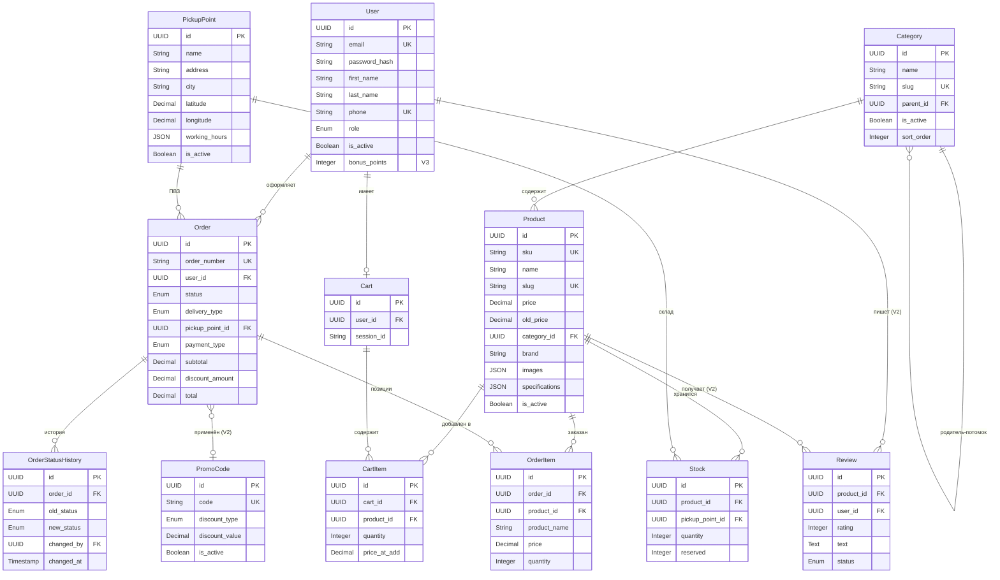

# Техническое задание: Процесс оформления заказа интернет-магазина электроники «ТехноСфера»

**Версия документа:** 1.0  
**Дата:** 09.02.2026  
**Автор:** Системный аналитик  
**Статус:** Черновик  

---

## План реализации по версиям

| Версия | Описание | Срок |
|--------|----------|------|
| **V1** | Базовый каталог, корзина, оформление заказа (самовывоз), регистрация/авторизация, личный кабинет покупателя, панель администратора | 3 месяца |
| **V2** | Курьерская доставка, онлайн-оплата (банковские карты, СБП), система промокодов, отзывы на товары, email-уведомления | 2 месяца |
| **V3** | Программа лояльности (бонусные баллы), рассрочка/кредит, сравнение товаров, списки желаний, расширенная аналитика для администратора | 2 месяца |

---

## 1. Основная проблема (цель)

### 1.1 Функциональные требования

| ID | Требование | Версия |
|----|-----------|--------|
| FR-01 | Регистрация и авторизация пользователей (email + пароль) | V1 |
| FR-02 | Просмотр каталога товаров с фильтрацией и сортировкой | V1 |
| FR-03 | Полнотекстовый поиск товаров с подсказками | V1 |
| FR-04 | Управление корзиной (добавление, удаление, изменение количества) | V1 |
| FR-05 | Оформление заказа с выбором ПВЗ и оплатой при получении | V1 |
| FR-06 | Личный кабинет с историей заказов | V1 |
| FR-07 | Панель администратора (управление товарами, заказами, пользователями) | V1 |
| FR-08 | Курьерская доставка с выбором даты и временного слота | V2 |
| FR-09 | Онлайн-оплата (банковские карты, СБП) | V2 |
| FR-10 | Система промокодов (фиксированная скидка / процент) | V2 |
| FR-11 | Отзывы на товары с рейтингом | V2 |
| FR-12 | Email-уведомления о статусе заказа | V2 |
| FR-13 | Программа лояльности (бонусные баллы) | V3 |
| FR-14 | Сравнение товаров (до 4 товаров одной категории) | V3 |
| FR-15 | Списки желаний | V3 |
| FR-16 | Расширенная аналитика для администратора | V3 |

### 1.2 Нефункциональные требования

| ID | Категория | Требование |
|----|-----------|------------|
| NFR-01 | Производительность | Время ответа сервера <= 500 мс при штатной нагрузке |
| NFR-02 | Производительность | Google PageSpeed Insights > 80 баллов |
| NFR-03 | Масштабируемость | 5 000 одновременных пользователей (V1), 50 000 (V3) |
| NFR-04 | Доступность | Uptime 99.5% |
| NFR-05 | Безопасность | Хранение только хеша пароля (bcrypt, cost=12), JWT RS256 |
| NFR-06 | Безопасность | HTTPS обязателен, OWASP Top 10 |
| NFR-07 | Совместимость | Chrome, Firefox, Safari, Edge (последние 2 версии) |
| NFR-08 | Адаптивность | Мобильные устройства (от 320px), планшеты, десктоп |
| NFR-09 | Локализация | Русский язык (основной), подготовка к i18n |
| NFR-10 | Резервирование | Ежедневное резервное копирование БД, хранение 30 дней |

### 1.3 Предпосылки

Покупатели электроники сталкиваются с рядом проблем при приобретении товаров в офлайн-магазинах:
- ограниченный выбор товаров в конкретной торговой точке;
- невозможность сравнить цены и характеристики нескольких товаров одновременно;
- затраты времени на поездку в магазин без гарантии наличия нужного товара;
- отсутствие информации о статусе заказа при предзаказе.

### 1.4 Цель

Разработать интернет-магазин электроники «ТехноСфера», обеспечивающий полный цикл покупки: от выбора товара в онлайн-каталоге до получения заказа. Основной фокус данного ТЗ - процесс оформления заказа.

### 1.5 Ожидаемые результаты

| Показатель | Целевое значение |
|------------|-----------------|
| Время оформления заказа от корзины до подтверждения | Не более 3 минут (не более 5 шагов) |
| Конверсия корзина → оформленный заказ | Не менее 40% |
| Количество одновременных пользователей (V1) | 5 000 |
| Количество одновременных пользователей (V3) | 50 000 |
| Google PageSpeed Insights (любая страница) | Более 80 баллов |
| Время ответа сервера на любой запрос | Не более 500 мс при штатной нагрузке |
| Доступность сервиса (uptime) | 99.5% |

---

## 2. Тезаурус

| Термин | Определение |
|--------|------------|
| **SKU** (Stock Keeping Unit) | Уникальный идентификатор (артикул) конкретного товара в системе учёта. Каждая вариация товара (цвет, объём памяти) имеет свой SKU |
| **Корзина** | Временное хранилище выбранных пользователем товаров перед оформлением заказа. Для авторизованного пользователя сохраняется на сервере, для неавторизованного  в cookie/localStorage браузера сроком до 30 дней |
| **Заказ** | Зафиксированный набор товаров с указанием способа получения и оплаты, имеющий уникальный номер и проходящий через определённые статусы |
| **Самовывоз** | Способ получения заказа, при котором покупатель забирает товар самостоятельно из выбранного пункта выдачи |
| **Курьерская доставка** | (V2) Способ получения заказа, при котором курьер привозит товар по указанному покупателем адресу |
| **Пункт выдачи заказов (ПВЗ)** | Физическая точка (магазин или склад), где покупатель может забрать оформленный заказ |
| **Промокод** | (V2) Буквенно-цифровой код, дающий скидку на заказ (фиксированную сумму или процент) |
| **СБП** | (V2) Система быстрых платежей - сервис Банка России для мгновенных переводов и оплаты по QR-коду |
| **Предавторизация платежа** | (V2) Блокировка суммы на банковской карте покупателя без фактического списания. Списание происходит при подтверждении заказа продавцом |
| **Бонусные баллы** | (V3) Единица внутренней программы лояльности. 1 балл = 1 рубль. Начисляются за покупки, могут использоваться для частичной оплаты заказа (не более 30% от суммы) |
| **Товарная позиция** | Одна строка в заказе: конкретный товар (SKU) в определённом количестве |
| **Остаток** | Количество единиц конкретного SKU, доступных для продажи на конкретном складе/ПВЗ |
| **Резерв** | Временная блокировка остатка товара при оформлении заказа. Снимается при отмене заказа или через 24 часа при отсутствии оплаты |

---

## 3. Структура сайта

### 3.1 Карта страниц


### 3.2 Ключевые переходы (процесс оформления заказа)

| Откуда | Куда | Условие перехода |
|--------|------|-----------------|
| Карточка товара | Корзина | Нажатие кнопки «В корзину» (товар в наличии) |
| Каталог / Поиск | Корзина | Нажатие кнопки «В корзину» в карточке товара в списке |
| Корзина | Оформление заказа (Шаг 1) | Нажатие кнопки «Оформить заказ» (корзина не пуста) |
| Шаг 1: Контактные данные | Шаг 2: Способ получения | Все обязательные поля заполнены и прошли валидацию |
| Шаг 2: Способ получения | Шаг 3: Способ оплаты | Выбран способ получения и адрес/ПВЗ |
| Шаг 3: Способ оплаты | Шаг 4: Подтверждение | Выбран способ оплаты |
| Шаг 4: Подтверждение | Заказ оформлен | Нажатие кнопки «Подтвердить заказ» и успешное создание заказа |
| Шаг 4: Подтверждение | Страница оплаты (внешняя) | (V2) Выбрана онлайн-оплата, редирект на платёжный шлюз |
| Любой шаг Checkout | Корзина | Нажатие кнопки «Вернуться в корзину» |
| Заказ оформлен | Детали заказа (ЛК) | Нажатие «Перейти к заказу» (если авторизован) |

[Диаграмма последовательности оформления заказа](/to/v1/03_диаграммы_последовательности.md#seq-order)


### 3.3 Архитектура системы


---

## 4. Детальное описание сущностей

### 4.0 ER-диаграмма



### 4.1 Пользователь (User)

| Атрибут | Тип | Обязательность | Описание | Правила |
|---------|-----|---------------|----------|---------|
| id | UUID | Авто | Уникальный идентификатор | Генерируется системой |
| email | String(255) | Да | Электронная почта | Уникальный, формат RFC 5322 |
| password_hash | String(255) | Да | Хеш пароля (bcrypt, cost=12). В БД хранится ТОЛЬКО хеш, исходный пароль не сохраняется | Требования к исходному паролю: минимум 8 символов, 1 заглавная, 1 цифра.  |
| first_name | String(100) | Да | Имя | От 2 до 100 символов, только буквы |
| last_name | String(100) | Да | Фамилия | От 2 до 100 символов, только буквы |
| phone | String(20) | Да | Номер телефона | Формат +7XXXXXXXXXX, уникальный |
| role | Enum | Авто | Роль пользователя | customer (по умолчанию), manager, admin |
| is_active | Boolean | Авто | Активен ли аккаунт | true по умолчанию |
| created_at | Timestamp | Авто | Дата регистрации | - |
| updated_at | Timestamp | Авто | Дата обновления | - |
| bonus_points | Integer | Авто | (V3) Бонусные баллы | По умолчанию 0, не может быть отрицательным |

**Связи:**
- Один пользователь → МНОГО заказов
- Один пользователь → МНОГО адресов (V2)
- Один пользователь → ОДНА корзина
- Один пользователь → МНОГО отзывов (V2)

### 4.2 Категория (Category)

| Атрибут | Тип | Обязательность | Описание | Правила |
|---------|-----|---------------|----------|---------|
| id | UUID | Авто | Уникальный идентификатор | - |
| name | String(200) | Да | Название категории | От 2 до 200 символов |
| slug | String(200) | Авто | URL-дружественное имя | Генерируется из name, уникальный |
| parent_id | UUID / null | Нет | Родительская категория | null для корневых категорий |
| icon_url | String(500) | Нет | URL иконки категории | - |
| is_active | Boolean | Авто | Активна ли категория | true по умолчанию |
| sort_order | Integer | Нет | Порядок сортировки | По умолчанию 0 |

**Связи:**
- Одна категория → МНОГО подкатегорий (self-reference)
- Одна категория → МНОГО товаров

### 4.3 Товар (Product)

| Атрибут | Тип | Обязательность | Описание | Правила |
|---------|-----|---------------|----------|---------|
| id | UUID | Авто | Уникальный идентификатор | - |
| sku | String(50) | Да | Артикул | Уникальный |
| name | String(300) | Да | Название товара | От 3 до 300 символов |
| slug | String(300) | Авто | URL-дружественное имя | Уникальный |
| description | Text | Да | Описание товара | До 10 000 символов |
| price | Decimal(12,2) | Да | Цена в рублях | Больше 0 |
| old_price | Decimal(12,2) | Нет | Старая цена (для отображения скидки) | Больше price, если указана |
| category_id | UUID | Да | ID категории | Ссылка на Category |
| brand | String(200) | Нет | Бренд/производитель | - |
| images | JSON | Да | Массив URL изображений | Минимум 1 изображение, максимум 10. Формат: [{url, alt, sort_order}] |
| specifications | JSON | Нет | Характеристики товара | Формат: [{name, value, unit}] |
| is_active | Boolean | Авто | Активен ли товар | true - отображается в каталоге |
| created_at | Timestamp | Авто | Дата создания | - |
| updated_at | Timestamp | Авто | Дата обновления | - |

**Связи:**
- Один товар → ОДНА категория
- Один товар → МНОГО остатков (Stock) на разных складах/ПВЗ
- Один товар → МНОГО отзывов (V2)
- Один товар → МНОГО товарных позиций в заказах

### 4.4 Остаток (Stock)

| Атрибут | Тип | Обязательность | Описание | Правила |
|---------|-----|---------------|----------|---------|
| id | UUID | Авто | Уникальный идентификатор | - |
| product_id | UUID | Да | ID товара | Ссылка на Product |
| pickup_point_id | UUID | Да | ID пункта выдачи/склада | Ссылка на PickupPoint |
| quantity | Integer | Да | Общее количество | >= 0 |
| reserved | Integer | Авто | Зарезервировано | >= 0, <= quantity |
| available | Integer | Вычисляемое | Доступно для продажи | quantity - reserved |

**Связи:**
- Один остаток → ОДИН товар
- Один остаток → ОДИН пункт выдачи (PickupPoint)

### 4.5 Пункт выдачи (PickupPoint)

| Атрибут | Тип | Обязательность | Описание | Правила |
|---------|-----|---------------|----------|---------|
| id | UUID | Авто | Уникальный идентификатор | - |
| name | String(300) | Да | Название | - |
| address | String(500) | Да | Адрес | - |
| city | String(200) | Да | Город | - |
| latitude | Decimal(9,6) | Да | Широта | - |
| longitude | Decimal(9,6) | Да | Долгота | - |
| working_hours | JSON | Да | Расписание работы | Формат: [{day_of_week, open, close}] |
| phone | String(20) | Нет | Телефон | - |
| is_active | Boolean | Авто | Активен | true по умолчанию |

**Связи:**
- Один ПВЗ → МНОГО остатков
- Один ПВЗ → МНОГО заказов

### 4.6 Корзина (Cart)

| Атрибут | Тип | Обязательность | Описание | Правила |
|---------|-----|---------------|----------|---------|
| id | UUID | Авто | Уникальный идентификатор | - |
| user_id | UUID / null | Нет | ID авторизованного пользователя | null для гостя |
| session_id | String(255) | Да | Идентификатор сессии гостя | Используется, если user_id = null |
| created_at | Timestamp | Авто | Дата создания | - |
| updated_at | Timestamp | Авто | Дата обновления | - |

**Связи:**
- Одна корзина → МНОГО позиций корзины (CartItem)
- Одна корзина → ОДИН пользователь (или сессия гостя)

### 4.7 Позиция корзины (CartItem)

| Атрибут | Тип | Обязательность | Описание | Правила |
|---------|-----|---------------|----------|---------|
| id | UUID | Авто | Уникальный идентификатор | - |
| cart_id | UUID | Да | ID корзины | Ссылка на Cart |
| product_id | UUID | Да | ID товара | Ссылка на Product |
| quantity | Integer | Да | Количество | От 1 до 99. Не может превышать доступный остаток |
| price_at_add | Decimal(12,2) | Авто | Цена на момент добавления | Для информирования об изменении цены |
| added_at | Timestamp | Авто | Дата добавления | - |

**Уникальность:** Комбинация (cart_id, product_id) уникальна - при повторном добавлении увеличивается quantity.

### 4.8 Заказ (Order)

| Атрибут | Тип | Обязательность | Описание | Правила |
|---------|-----|---------------|----------|---------|
| id | UUID | Авто | Уникальный идентификатор | - |
| order_number | String(20) | Авто | Номер заказа (человекочитаемый) | Формат: TS-YYYYMMDD-XXXXX (пример: TS-20260209-00042) |
| user_id | UUID / null | Нет | ID пользователя | null для заказа гостем |
| status | Enum | Авто | Статус заказа | См. диаграмму состояний |
| contact_first_name | String(100) | Да | Имя контактного лица | - |
| contact_last_name | String(100) | Да | Фамилия контактного лица | - |
| contact_email | String(255) | Да | Email для уведомлений | Формат RFC 5322 |
| contact_phone | String(20) | Да | Телефон контактного лица | Формат +7XXXXXXXXXX |
| delivery_type | Enum | Да | Способ получения | pickup (V1), courier (V2) |
| pickup_point_id | UUID / null | Условно | ID пункта выдачи | Обязательно если delivery_type = pickup |
| delivery_address | String(500) / null | Условно | (V2) Адрес доставки | Обязательно если delivery_type = courier |
| delivery_date | Date / null | Нет | (V2) Желаемая дата доставки | Не ранее следующего рабочего дня |
| delivery_time_slot | String(20) / null | Нет | (V2) Временной слот | Формат: "10:00-14:00", "14:00-18:00", "18:00-22:00" |
| payment_type | Enum | Да | Способ оплаты | cash_on_delivery (V1), card_online (V2), sbp (V2) |
| promo_code_id | UUID / null | Нет | (V2) Применённый промокод | Ссылка на PromoCode |
| subtotal | Decimal(12,2) | Авто | Сумма товаров до скидки | Сумма (price × quantity) всех позиций |
| discount_amount | Decimal(12,2) | Авто | Сумма скидки | По умолчанию 0 |
| delivery_cost | Decimal(12,2) | Авто | Стоимость доставки | 0 для самовывоза (V1) |
| total | Decimal(12,2) | Авто | Итого к оплате | subtotal - discount_amount + delivery_cost |
| bonus_points_used | Integer | Нет | (V3) Использовано баллов | Не более 30% от total |
| comment | Text | Нет | Комментарий к заказу | До 1000 символов |
| created_at | Timestamp | Авто | Дата создания заказа | - |
| updated_at | Timestamp | Авто | Дата обновления | - |
| paid_at | Timestamp / null | Нет | Дата оплаты | - |
| completed_at | Timestamp / null | Нет | Дата завершения | - |
| cancelled_at | Timestamp / null | Нет | Дата отмены | - |
| cancel_reason | String(500) / null | Нет | Причина отмены | - |

**Связи:**
- Один заказ → МНОГО товарных позиций (OrderItem)
- Один заказ → ОДИН пользователь (или гость)
- Один заказ → ОДИН ПВЗ (при самовывозе)
- Один заказ → МНОГО записей истории статусов (OrderStatusHistory)
- Один заказ → ОДИН промокод или NULL (V2)
- Один заказ → ОДНА транзакция оплаты или NULL (V2)

### 4.9 Товарная позиция заказа (OrderItem)

| Атрибут | Тип | Обязательность | Описание | Правила |
|---------|-----|---------------|----------|---------|
| id | UUID | Авто | Уникальный идентификатор | - |
| order_id | UUID | Да | ID заказа | Ссылка на Order |
| product_id | UUID | Да | ID товара | Ссылка на Product |
| product_name | String(300) | Авто | Название товара (снимок) | Фиксируется на момент оформления, не меняется при изменении товара |
| product_sku | String(50) | Авто | Артикул (снимок) | - |
| price | Decimal(12,2) | Авто | Цена за единицу (снимок) | Фиксируется на момент оформления |
| quantity | Integer | Да | Количество | От 1 до 99 |
| total | Decimal(12,2) | Авто | Сумма позиции | price × quantity |

### 4.10 История статусов заказа (OrderStatusHistory)

| Атрибут | Тип | Обязательность | Описание | Правила |
|---------|-----|---------------|----------|---------|
| id | UUID | Авто | Уникальный идентификатор | - |
| order_id | UUID | Да | ID заказа | Ссылка на Order |
| status | Enum | Да | Новый статус | - |
| changed_by | UUID / null | Нет | Кто изменил статус | null - автоматически системой |
| comment | String(500) | Нет | Комментарий | - |
| created_at | Timestamp | Авто | Дата и время изменения | - |

### 4.11 Промокод (PromoCode) - V2

| Атрибут | Тип | Обязательность | Описание | Правила |
|---------|-----|---------------|----------|---------|
| id | UUID | Авто | Уникальный идентификатор | - |
| code | String(50) | Да | Код промокода | Уникальный, только A-Z0-9, от 4 до 50 символов |
| discount_type | Enum | Да | Тип скидки | fixed (фиксированная сумма), percent (процент) |
| discount_value | Decimal(12,2) | Да | Значение скидки | Для fixed: сумма в рублях. Для percent: от 1 до 99 |
| min_order_amount | Decimal(12,2) | Нет | Мин. сумма заказа | - |
| max_discount_amount | Decimal(12,2) | Нет | Макс. сумма скидки (для percent) | - |
| usage_limit | Integer | Нет | Лимит общего использования | null - без лимита |
| usage_count | Integer | Авто | Текущее число использований | - |
| valid_from | Timestamp | Да | Дата начала действия | - |
| valid_until | Timestamp | Да | Дата окончания действия | > valid_from |
| is_active | Boolean | Авто | Активен | - |

### 4.12 Отзыв (Review) - V2

| Атрибут | Тип | Обязательность | Описание | Правила |
|---------|-----|---------------|----------|---------|
| id | UUID | Авто | Уникальный идентификатор | - |
| product_id | UUID | Да | ID товара | Ссылка на Product |
| user_id | UUID | Да | ID автора | Только авторизованные |
| rating | Integer | Да | Оценка | От 1 до 5 |
| text | Text | Нет | Текст отзыва | До 5000 символов |
| is_verified_purchase | Boolean | Авто | Подтверждённая покупка | true, если пользователь покупал данный товар |
| status | Enum | Авто | Статус модерации | pending, approved, rejected |
| created_at | Timestamp | Авто | Дата создания | - |

**Связи:**
- Один отзыв → ОДИН товар
- Один отзыв → ОДИН пользователь
- Один товар → МНОГО отзывов
- Один пользователь может оставить не более ОДНОГО отзыва на один товар

---

## 5. Сценарии использования сайта (функциональные особенности)

### 5.1 Роли пользователей

| Роль | Описание | Версия |
|------|----------|--------|
| **Гость** | Неавторизованный посетитель. Может просматривать каталог, класть товары в корзину, оформлять заказ с указанием контактных данных | V1 |
| **Покупатель** (customer) | Авторизованный пользователь. Все возможности гостя + личный кабинет, история заказов, сохранённые данные для быстрого оформления | V1 |
| **Менеджер** (manager) | Сотрудник магазина. Управление заказами (смена статусов), просмотр каталога и остатков, модерация отзывов (V2) | V1 |
| **Администратор** (admin) | Полный доступ. Все возможности менеджера + управление товарами, категориями, ПВЗ, пользователями, промокодами, аналитика | V1 |

### 5.2 Сценарий UC-01: Регистрация пользователя (V1)

**Актор:** Гость  
**Предусловие:** Пользователь находится на странице регистрации  
**Результат:** Пользователь зарегистрирован, авторизован и перенаправлен на предыдущую страницу

**Основной сценарий:**

1. Гость заполняет поля: Имя, Фамилия, Email, Телефон, Пароль, Подтверждение пароля.
2. Система проверяет: все обязательные поля заполнены, email и телефон уникальны, пароль соответствует требованиям (минимум 8 символов, 1 заглавная буква, 1 цифра), пароль и подтверждение совпадают.
3. Система создаёт учётную запись с ролью customer.
4. Система автоматически авторизует пользователя.
5. Если у гостя была корзина (по session_id) - она привязывается к учётной записи.
6. Пользователь перенаправляется на страницу, с которой перешёл на регистрацию.

**Альтернативные сценарии:**

- **2а.** Email уже зарегистрирован → Система отображает сообщение «Пользователь с таким email уже зарегистрирован» под полем email. Предлагает ссылку «Войти» или «Восстановить пароль».
- **2б.** Телефон уже зарегистрирован → Аналогичное сообщение «Пользователь с таким номером телефона уже зарегистрирован».
- **2в.** Пароль не соответствует требованиям → Сообщение «Пароль должен содержать минимум 8 символов, включая 1 заглавную букву и 1 цифру».
- **2г.** Пароль и подтверждение не совпадают → Сообщение «Пароли не совпадают».

### 5.3 Сценарий UC-02: Авторизация пользователя (V1)

**Актор:** Гость  
**Предусловие:** Пользователь находится на странице авторизации  
**Результат:** Пользователь авторизован

**Основной сценарий:**

1. Гость вводит email и пароль.
2. Система проверяет учётные данные.
3. Система авторизует пользователя, выдаёт JWT-токены (access + refresh).
4. Если у гостя была корзина - объединяет с корзиной пользователя (при совпадении товаров оставляется большее количество).
5. Пользователь перенаправляется на предыдущую страницу.

**Альтернативные сценарии:**

- **2а.** Неверный email или пароль → Сообщение «Неверный email или пароль» (без уточнения что именно неверно - из соображений безопасности). Счётчик попыток +1.
- **2б.** Пользователь заблокирован (is_active = false) → Сообщение «Аккаунт заблокирован. Обратитесь в поддержку».
- **2в.** 5 неудачных попыток подряд → Блокировка входа на 15 минут, уведомление на email пользователя.

### 5.4 Сценарий UC-03: Добавление товара в корзину (V1)

**Актор:** Гость или Покупатель  
**Предусловие:** Пользователь находится на странице каталога или карточке товара  
**Результат:** Товар добавлен в корзину

**Основной сценарий:**

1. Пользователь нажимает кнопку «В корзину» на карточке товара.
2. Система проверяет доступный остаток товара (суммарно по всем ПВЗ).
3. Если товар уже есть в корзине - quantity увеличивается на 1.
4. Если товара нет в корзине - создаётся новая позиция с quantity = 1.
5. Система отображает уведомление «Товар добавлен в корзину» (popup на 3 секунды) с кнопками «Продолжить покупки» и «Перейти в корзину».
6. Счётчик товаров в иконке корзины (хедер) обновляется.

**Альтернативные сценарии:**

- **2а.** Товар отсутствует в наличии (available = 0 по всем ПВЗ) → Кнопка «В корзину» заменена на «Нет в наличии» (неактивна). Добавление невозможно.
- **3а.** Увеличение quantity превышает доступный остаток → Сообщение «Можно добавить не более {available} шт. данного товара».

### 5.5 Сценарий UC-04: Просмотр и редактирование корзины (V1)

**Актор:** Гость или Покупатель  
**Предусловие:** Пользователь находится на странице корзины  
**Результат:** Корзина отредактирована

**Основной сценарий:**

1. Система отображает список товаров в корзине: изображение, название (ссылка на товар), цена за единицу, количество (поле ввода с кнопками +/-), сумма позиции, кнопка «Удалить».
2. Под списком отображается: общая сумма, кнопка «Оформить заказ».
3. Пользователь может изменить количество товара - система пересчитывает сумму в реальном времени.
4. Пользователь может удалить товар из корзины.

**Альтернативные сценарии:**

- **1а.** Корзина пуста → Текст «Корзина пуста», кнопка «Перейти в каталог».
- **1б.** Цена товара изменилась с момента добавления → Жёлтое информационное сообщение «Цена на {название} изменилась: была {старая_цена} ₽, стала {новая_цена} ₽». Отображается новая цена.
- **1в.** Товар стал недоступен после добавления в корзину → Позиция помечена серым, текст «Нет в наличии». Кнопка «Удалить». Товар не учитывается в общей сумме и не может быть заказан.
- **3а.** Пользователь вводит количество > доступного остатка → Количество автоматически снижается до максимально доступного. Сообщение «Доступно {available} шт.».
- **3б.** Пользователь вводит 0 или отрицательное число → Количество устанавливается в 1.

### 5.6 Сценарий UC-05: Оформление заказа (V1)

**Актор:** Гость или Покупатель  
**Предусловие:** Корзина не пуста, все товары в наличии  
**Результат:** Заказ создан, товары зарезервированы

**Основной сценарий:**

**Шаг 1 - Контактные данные:**

1. Если пользователь авторизован - поля предзаполнены из профиля (Имя, Фамилия, Email, Телефон). Пользователь может изменить.
2. Если гость - поля пустые, обязательны для заполнения.
3. Пользователь заполняет/проверяет данные и нажимает «Далее».
4. Система валидирует все поля.

**Шаг 2 - Способ получения:**

5. (V1) Отображается единственный вариант - «Самовывоз из пункта выдачи».
6. Система отображает карту с метками ПВЗ и список ПВЗ с адресами и часами работы.
7. Для каждого ПВЗ показана доступность товаров из корзины (все в наличии / частично / нет в наличии).
8. Пользователь выбирает ПВЗ, где все товары из корзины доступны.
9. Нажимает «Далее».

**(V2) Дополнительно:** 
опция «Курьерская доставка». При выборе - поля: Адрес (улица, дом, квартира, подъезд, этаж, домофон), Дата доставки (не ранее следующего рабочего дня), Временной слот (10:00-14:00 / 14:00-18:00 / 18:00-22:00). Стоимость доставки рассчитывается автоматически.

**Шаг 3 - Подтверждение:**

12. Система отображает сводку заказа: 
    - список товаров (фото, название, количество, цена, сумма), 
    - контактные данные, способ получения (адрес ПВЗ), 
    - способ оплаты, 
    - промокод и скидка (V2), 
    - бонусные баллы (V3), 
    - итого к оплате, 
    - поле «Комментарий к заказу» (необязательно).
    
13. Пользователь проверяет данные и нажимает «Подтвердить заказ».
14. Система делает финальную проверку остатков.
15. Система резервирует товары на выбранном ПВЗ.
16. Система создаёт заказ со статусом «Новый».
17. Система очищает корзину.
18. (V2) Если онлайн-оплата - редирект на платёжный шлюз. После успешной оплаты - статус «Оплачен».
19. Пользователь перенаправляется на страницу «Заказ оформлен» с номером заказа и деталями.
20. (V2) На email отправляется подтверждение заказа.

**Шаг 4 - Способ оплаты:**

10. (V1) Единственный вариант - «Оплата при получении» (наличными или картой при самовывозе).
11. Пользователь нажимает «Далее».

**(V2) Дополнительно:** «Банковской картой онлайн», «СБП (по QR-коду)». Поле для промокода.

**(V3) Дополнительно:** Чекбокс «Использовать бонусные баллы» с указанием доступного количества и суммы скидки.

**Альтернативные сценарии:**

- **4а.** Валидация не пройдена → Поля с ошибками подсвечены красным, под ними текст ошибки. Переход на шаг 2 невозможен.
- **8а.** Ни в одном ПВЗ нет полного набора товаров → Система предлагает: «Разделить заказ на 2 части?» с группировкой товаров по ПВЗ. Или: «Убрать товары, которых нет (Х шт.)».
- **18а.** (V2) Онлайн-оплата отклонена → Заказ сохраняется со статусом «Ожидает оплаты». Сообщение «Оплата не прошла. Попробуйте ещё раз или выберите другой способ оплаты.» Ссылка на повторную оплату (действует 24 часа).
- **18б.** (V2) Пользователь закрыл страницу оплаты → Заказ остаётся в статусе «Ожидает оплаты» 24 часа. По истечении - автоматическая отмена.

### 5.7 Сценарий UC-06: Просмотр статуса заказа (V1)

**Актор:** Покупатель  
**Предусловие:** Заказ оформлен, пользователь авторизован  

**Основной сценарий:**

1. Пользователь открывает «Мои заказы» в личном кабинете.
2. Система отображает список заказов (от нового к старому): номер, дата, статус, сумма, количество товаров.
3. Пользователь нажимает на заказ.
4. Система отображает полную информацию: дерево статусов с датами, список товаров, способ получения и адрес, способ оплаты, итого.

**Альтернативный сценарий:**

- **1а.** Гость → Доступ по прямой ссылке: /order-status?number={order_number}&email={email}. Форма: «Номер заказа» + «Email». При совпадении - отображается статус.

### 5.8 Сценарий UC-07: Отмена заказа (V1)

**Актор:** Покупатель или Менеджер  
**Предусловие:** Заказ в статусе «Новый» или «Оплачен» или «Ожидает оплаты»

**Основной сценарий (Покупатель):**

1. В деталях заказа пользователь нажимает «Отменить заказ».
2. Система запрашивает причину отмены (выпадающий список: «Передумал», «Нашёл дешевле», «Долгое ожидание», «Другое» + поле для комментария).
3. Пользователь подтверждает отмену.
4. Система снимает резерв товаров.
5. (V2) Если заказ был оплачен онлайн - инициируется возврат средств (автоматически, в течение 3-5 рабочих дней).
6. Статус заказа → «Отменён».

**Альтернативный сценарий:**

- **1а.** Заказ уже в статусе «Собирается» или далее → Кнопка «Отменить» недоступна. Текст: «Для отмены заказа в статусе "{статус}" обратитесь по телефону {номер_горячей_линии}».

### 5.9 Сценарий UC-09: Поиск товаров (V1)

**Актор:** Гость или Покупатель  
**Предусловие:** Пользователь находится на любой странице (поисковая строка в хедере)

**Основной сценарий:**

1. Пользователь вводит запрос в поисковую строку (минимум 2 символа).
2. После ввода 3+ символов или нажатия Enter - система выполняет поиск.
3. Через 300 мс после последнего ввода - отображается выпадающий список до 5 подсказок (название товара + цена + фото).
4. При нажатии Enter или кнопки «Найти» - переход на страницу результатов.
5. Результаты содержат: количество найденных товаров, список карточек товаров, фильтры (цена от-до, бренд, категория, наличие), сортировка (по цене, по популярности, по новизне).

**Альтернативные сценарии:**
- **4а.** По запросу не найдено товаров → Текст «По запросу "{query}" ничего не найдено». Блок «Возможно, вы искали:» с похожими запросами. Блок «Популярные товары» (8 карточек).
- **2а.** Запрос менее 2 символов → Сообщение «Введите минимум 2 символа для поиска».

### 5.10 Обработка ошибок

| Ситуация | Поведение сайта |
|----------|----------------|
| Ошибка сервера (HTTP 500) | Страница с текстом: «Произошла ошибка. Повторите попытку позже. Если ошибка повторяется, обратитесь в поддержку: {email_поддержки}». Кнопка «На главную». Логирование ошибки на стороне сервера |
| Страница не найдена (HTTP 404) | Страница с текстом: «Страница не найдена». Кнопки: «На главную», «В каталог». Поисковая строка |
| Таймаут запроса (> 15 секунд) | Автоматическая повторная попытка (до 2 раз). При неудаче - «Не удалось загрузить данные. Проверьте интернет-соединение и попробуйте снова». Кнопка «Повторить» |
| Ошибка оплаты | (V2) Текст: «Оплата не прошла. Попробуйте ещё раз или выберите другой способ оплаты». Заказ сохраняется. Ссылка на повторную оплату |
| Потеря соединения при оформлении | Данные шагов 1-3 сохранены в localStorage. При возвращении - данные восстанавливаются. Сообщение: «Ваши данные сохранены. Продолжите оформление» |

---

## 6. Прототипы и/или макеты страниц

### 6.1 Корзина

[Корзина cart excalidraw](excalidraw/cart.excalidraw)


### 6.2 Оформление заказа - Шаг 1: Контактные данные

[Контактные данные Оформление заказа excalidraw](excalidraw/exorder_step1.excalidraw)


### 6.3 Оформление заказа - Шаг 2: Способ получения

[Способ получения Оформление заказа excalidraw](excalidraw/order_step2.excalidraw)


### 6.4 Оформление заказа - Шаг 3: Подтверждение

[Подтверждение Оформление заказа excalidraw](excalidraw/order_step3.excalidraw)


### 6.5 Страница «Заказ оформлен»

[Заказ Оформлен excalidraw](excalidraw/order_success.excalidraw)


---

## 7. Сквозные элементы

### СЭ-01: Шапка сайта (Header)

Отображается на всех страницах. Фиксированная (sticky) при прокрутке.


### СЭ-02: Подвал сайта (Footer)

Отображается на всех страницах, кроме страниц админ-панели.

```

Покупателям          Компания         Контакты                     
Доставка и оплата    О компании       Тел: 8-800-XXX-XX-XX        
Возврат и обмен      Вакансии         Email: support@technosfera.ru
Бонусная программа   (V3)             Адрес: г. Москва, ул. ...   
                                                                  
© 2026 ТехноСфера   Политика конфиденциальности   Оферта       

```

### СЭ-03: Выпадающее меню каталога

Многоуровневое меню, отображаемое при взаимодействии с кнопкой «Каталог» в хедере.

| Поведение | Описание |
|-----------|----------|
| Открытие | По клику на десктопе, по тапу на мобильном |
| Уровень 1 | Список корневых категорий с иконками (левая колонка) |
| Уровень 2 | При наведении на категорию - подкатегории (правая колонка) |
| Закрытие | Клик вне меню или по кнопке «Каталог» повторно |
| Максимальная глубина | 3 уровня вложенности |

### СЭ-04: Уведомление (Toast/Snackbar)

Всплывающее уведомление в правом верхнем углу экрана.

| Параметр | Значение |
|----------|----------|
| Типы | success (зелёный), error (красный), warning (жёлтый), info (синий) |
| Длительность | 3 секунды (автозакрытие), либо до ручного закрытия (для error) |
| Максимум одновременно | 3 уведомления, остальные ждут в очереди |
| Кнопка закрытия | Крестик в правом верхнем углу уведомления |

### СЭ-05: Всплывающее окно подтверждения (Confirmation Modal)

| Параметр | Значение |
|----------|----------|
| Затемнение фона | Полупрозрачный чёрный оверлей (opacity: 0.5) |
| Содержимое | Заголовок, текст, кнопка «Подтвердить», кнопка «Отмена» |
| Закрытие | По кнопке «Отмена», по клику на оверлей, по нажатию Escape |
| Используется для | Удаление товара из корзины, отмена заказа, удаление аккаунта |

---

## 8. Уникальные страницы

### 8.1 Группы страниц на общем макете

| Группа макета | Страницы | Уникальная страница (эталон) |
|----|------|------|
| [Макет «Каталог»](excalidraw/frontend-catalog-draw.excalidraw.excalidraw) | Список товаров в категории, Результаты поиска, Список товаров бренда | Категория (/catalog/{category-slug}) |
| Макет «Карточка товара» | Карточка любого товара | /product/{product-slug} |
| Макет «Checkout Step» | Шаг 1-4 оформления заказа | Шаг 1 - Контактные данные |
| Макет «Информационная страница» | О компании, Доставка и оплата, Возврат и обмен, Контакты, Политика конфиденциальности | Доставка и оплата (/delivery-info) |
| Макет «Личный кабинет» | Мои заказы, Профиль, Адреса (V2) | Мои заказы (/account/orders) |
| Макет «Таблица админки» | Управление заказами, товарами, пользователями, ПВЗ, промокодами (V2) | Управление заказами (/admin/orders) |
| Макет «Форма админки» | Создание/редактирование товара, категории, ПВЗ, промокода (V2) | Редактирование товара (/admin/products/{id}/edit) |
| Макет «Авторизация» | Авторизация, Регистрация, Восстановление пароля | Авторизация (/auth/login) |

## 9. Параметры анимации

| Элемент | Событие | Анимация | Длительность | Кривая |
|---------|---------|----------|-------------|--------|
| header | Появление при загрузке страницы | Слайд сверху + fade-in | 300 мс | ease-out |
| header | Фиксация при прокрутке | Плавное изменение фона (transparent → solid) | 200 мс | ease |
| header | Скрытие при прокрутке вниз | Слайд вверх + fade-out | 200 мс | ease-in |
| header | Появление при прокрутке вверх | Слайд вниз + fade-in | 200 мс | ease-out |
| Карточка товара (каталог) | При появлении в зоне видимости | Плавное появление (fade-in) + лёгкое увеличение (scale(0.95→1)) | 300 мс | ease-out |
| Карточка товара (каталог) | При исчезновении из зоны видимости | Плавное исчезновение (fade-out) + лёгкое уменьшение (scale(1→0.95)) | 200 мс | ease-in |
| СЭ-04: Уведомление | Появление | Слайд справа + fade-in | 300 мс | ease-out |
| СЭ-04: Уведомление | Исчезновение | Слайд вправо + fade-out | 200 мс | ease-in |
| СЭ-05: Модальное окно | Открытие | Оверлей fade-in + окно scale(0.95→1) + fade-in | 250 мс | ease-out |
| СЭ-05: Модальное окно | Закрытие | Оверлей fade-out + окно scale(1→0.95) + fade-out | 200 мс | ease-in |
| СЭ-03: Меню каталога | Открытие | Слайд сверху + fade-in | 200 мс | ease-out |
| СЭ-03: Меню каталога | Закрытие | Слайд вверх + fade-out | 150 мс | ease-in |
| Кнопка «В корзину» | Клик | Изменение фона (transition) + иконка check (fade) | 300 мс | ease |
| Кнопка «В корзину» | Состояние «Добавлен» | Текст меняется на «V В корзине» с зелёным фоном на 1,5 сек, затем возврат | 300 мс (переход) | ease |
| Счётчик корзины (хедер) | Обновление | Цифра scale(1→1.3→1) «пружина» | 200 мс | ease-in-out |
| Checkout: Прогресс-бар | Переход между шагами | Плавное заполнение цветом полоски прогресса слева направо | 500 мс | ease |
| Карточка товара (каталог) | Наведение курсора | Подъём тени (box-shadow) + поднятие на 2px (translateY) | 200 мс | ease-out |
| Загрузка данных (Skeleton) | Отображение | Пульсация серых блоков-заглушек (shimmer-эффект, градиент движущийся слева направо) | 1500 мс (цикл) | linear (бесконечно) |
| Спиннер загрузки | Вращение | Rotation 360° | 800 мс (цикл) | linear (бесконечно) |
| Пагинация (СЭ-07) | Переход | Без анимации (мгновенная перезагрузка контента) | - | - |
