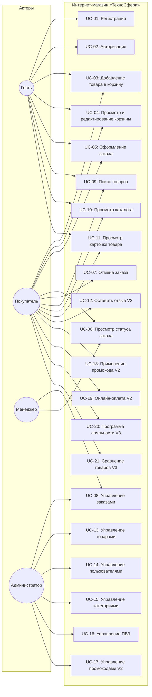
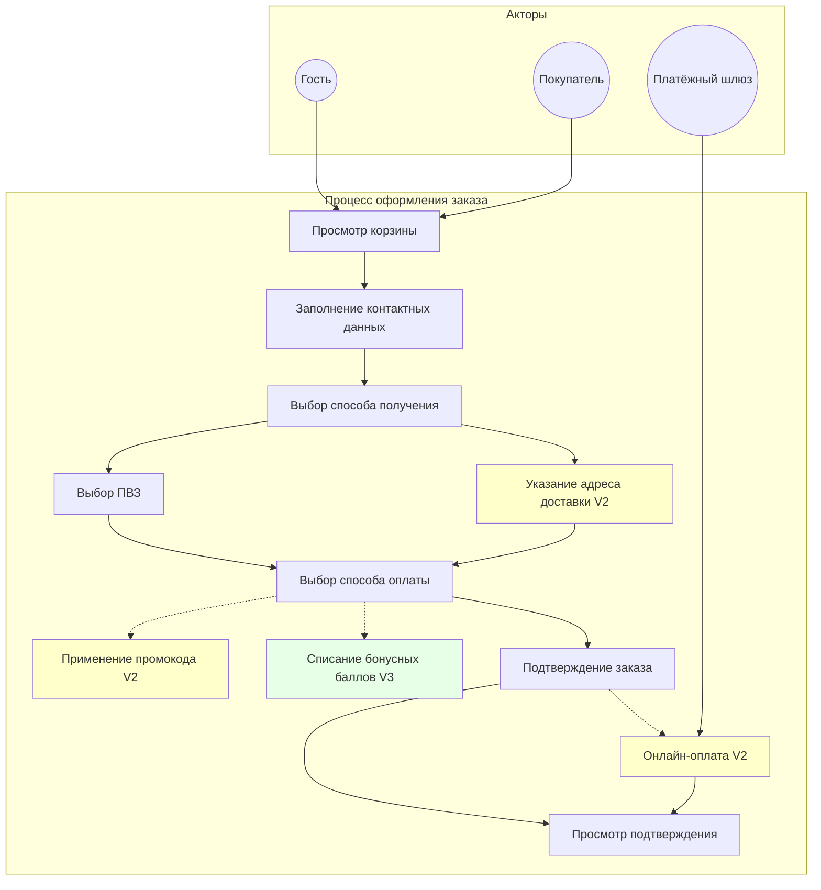
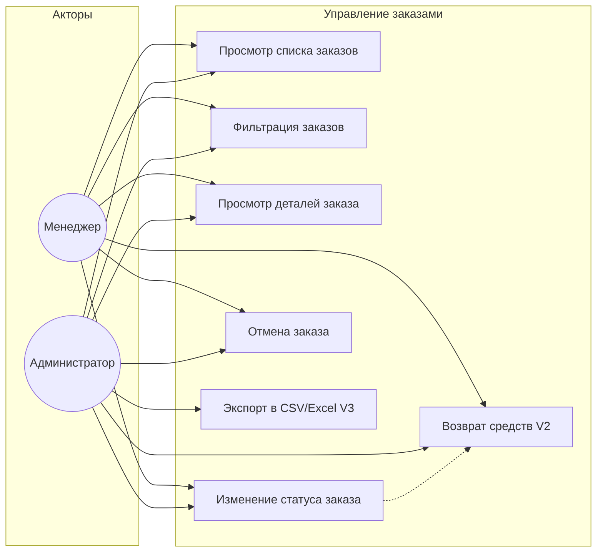
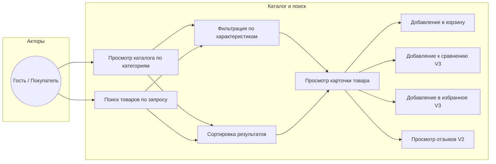

# Приложение A. Диаграммы использования (Use Case Diagrams)

> Диаграммы выполнены в нотации Mermaid. Для визуализации используйте любой Mermaid-рендерер.

---

## A.1 Общая диаграмма использования интернет-магазина

---

## A.2 Диаграмма использования: Процесс оформления заказа (детализация)

**Легенда:**
- Белый - V1
- Жёлтый - V2
- Зелёный - V3

---

## A.3 Диаграмма использования: Управление заказами (Менеджер / Администратор)

---

## A.4 Диаграмма использования: Каталог и поиск

---

## A.5 Описание прецедентов (таблица)

| ID | Название | Актор(ы) | Версия | Краткое описание |
|----|---------|----------|--------|-----------------|
| UC-01 | Регистрация | Гость | V1 | Создание учётной записи с email, паролем и контактными данными |
| UC-02 | Авторизация | Гость | V1 | Вход в систему по email + пароль, получение JWT-токенов |
| UC-03 | Добавление товара в корзину | Гость, Покупатель | V1 | Добавление товара (SKU) в корзину с проверкой остатка |
| UC-04 | Просмотр и редактирование корзины | Гость, Покупатель | V1 | Изменение количества, удаление, пересчёт суммы |
| UC-05 | Оформление заказа | Гость, Покупатель | V1 | Четырёхшаговый процесс: контакты → получение → оплата → подтверждение |
| UC-06 | Просмотр статуса заказа | Покупатель, Менеджер | V1 | Просмотр текущего статуса и истории изменений заказа |
| UC-07 | Отмена заказа | Покупатель, Менеджер | V1 | Отмена заказа с указанием причины. Снятие резерва. Возврат средств (V2) |
| UC-08 | Управление заказами | Менеджер, Администратор | V1 | Просмотр списка, фильтрация, смена статусов, управление заказами |
| UC-09 | Поиск товаров | Гость, Покупатель | V1 | Полнотекстовый поиск по каталогу с подсказками и фильтрацией |
| UC-10 | Просмотр каталога | Гость, Покупатель | V1 | Навигация по дереву категорий с фильтрами и сортировкой |
| UC-11 | Просмотр карточки товара | Гость, Покупатель | V1 | Детальная информация о товаре: фото, описание, характеристики, цена, наличие |
| UC-12 | Оставить отзыв | Покупатель | V2 | Оценка 1-5 + текст. Только для купленных товаров. Модерация |
| UC-13 | Управление товарами | Администратор | V1 | CRUD для товаров: создание, редактирование, удаление, управление остатками |
| UC-14 | Управление пользователями | Администратор | V1 | Просмотр, блокировка, смена ролей |
| UC-15 | Управление категориями | Администратор | V1 | CRUD для дерева категорий |
| UC-16 | Управление ПВЗ | Администратор | V1 | CRUD для пунктов выдачи |
| UC-17 | Управление промокодами | Администратор | V2 | CRUD для промокодов: тип скидки, лимиты, период действия |
| UC-18 | Применение промокода | Покупатель | V2 | Ввод промокода при оформлении, валидация, расчёт скидки |
| UC-19 | Онлайн-оплата | Покупатель | V2 | Оплата банковской картой или через СБП с редиректом на платёжный шлюз |
| UC-20 | Программа лояльности | Покупатель | V3 | Начисление и списание бонусных баллов |
| UC-21 | Сравнение товаров | Гость, Покупатель | V3 | Добавление до 4 товаров одной категории в таблицу сравнения |
