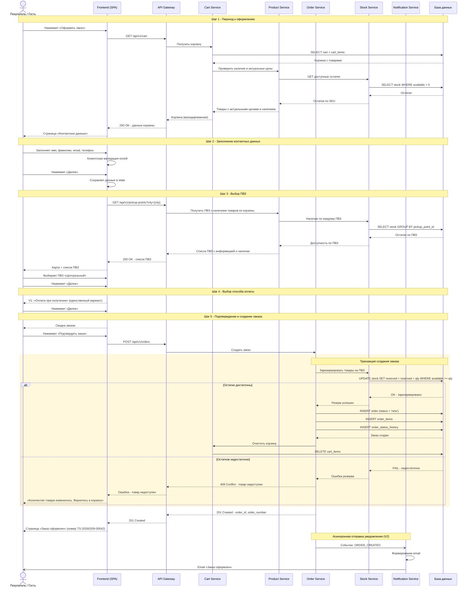
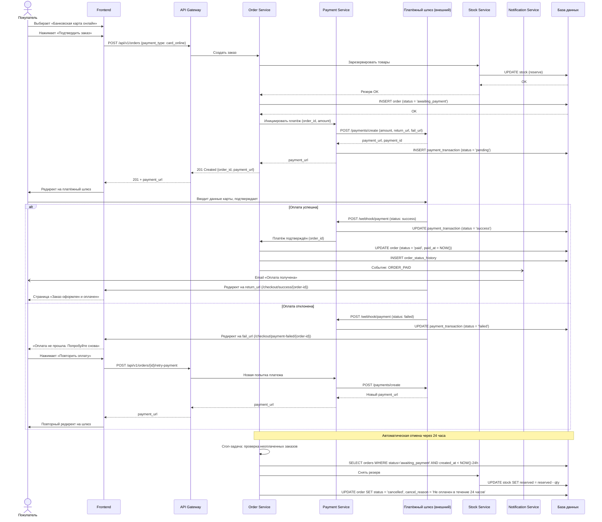
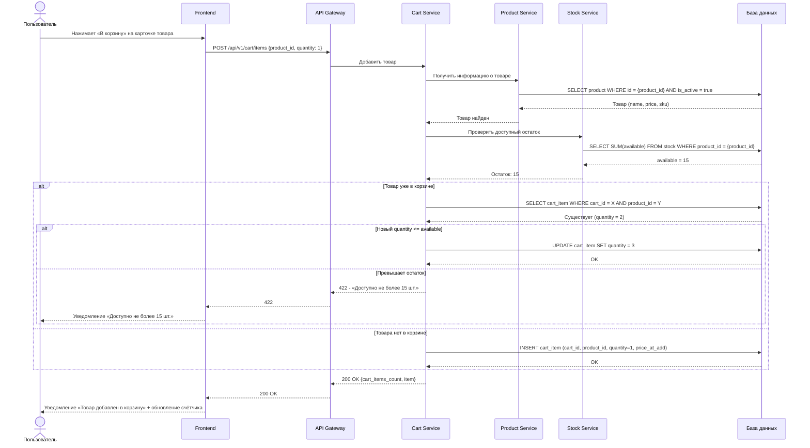
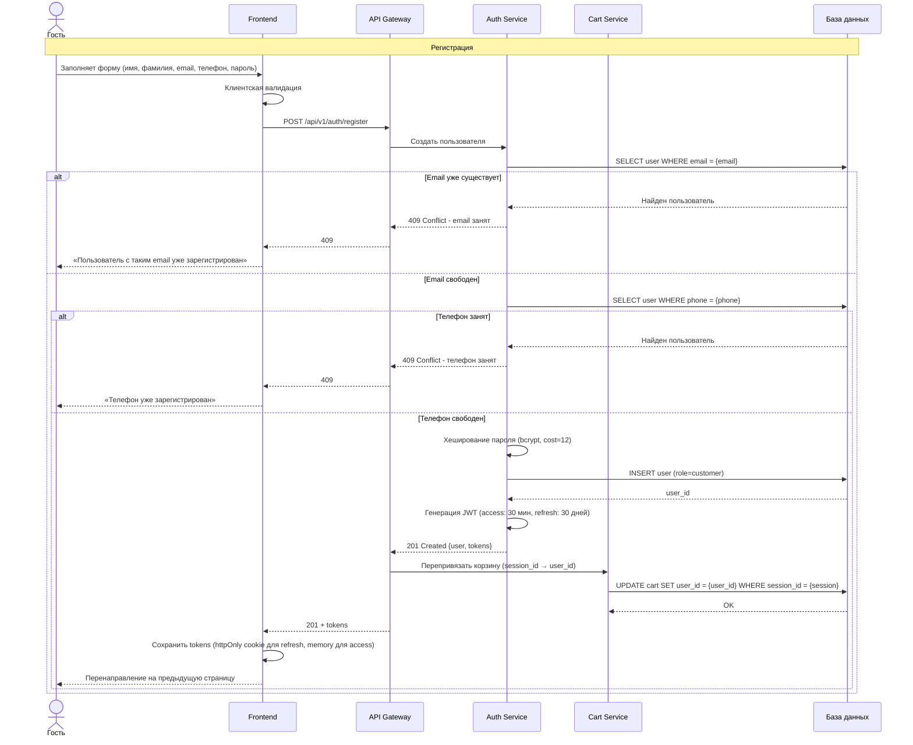
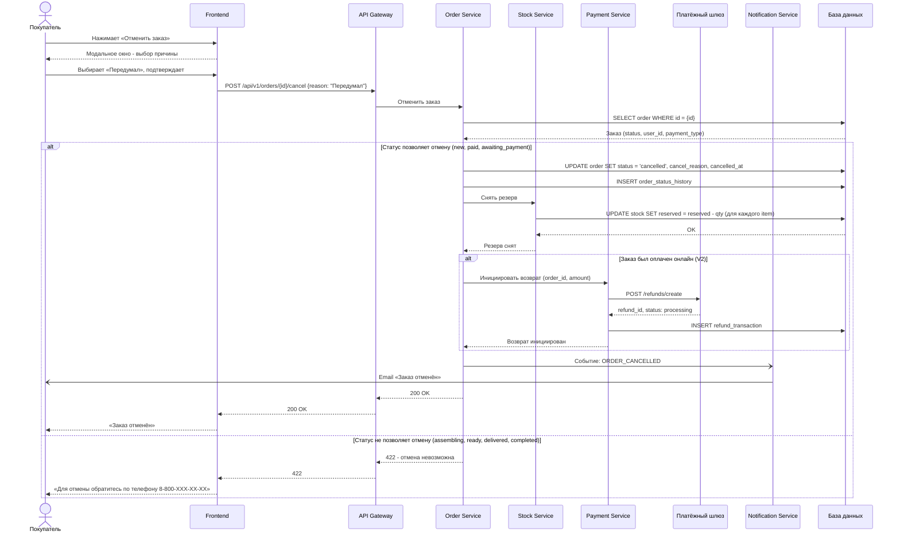
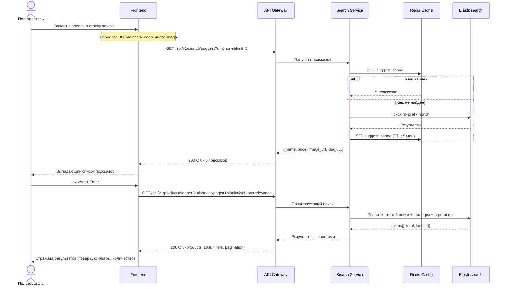
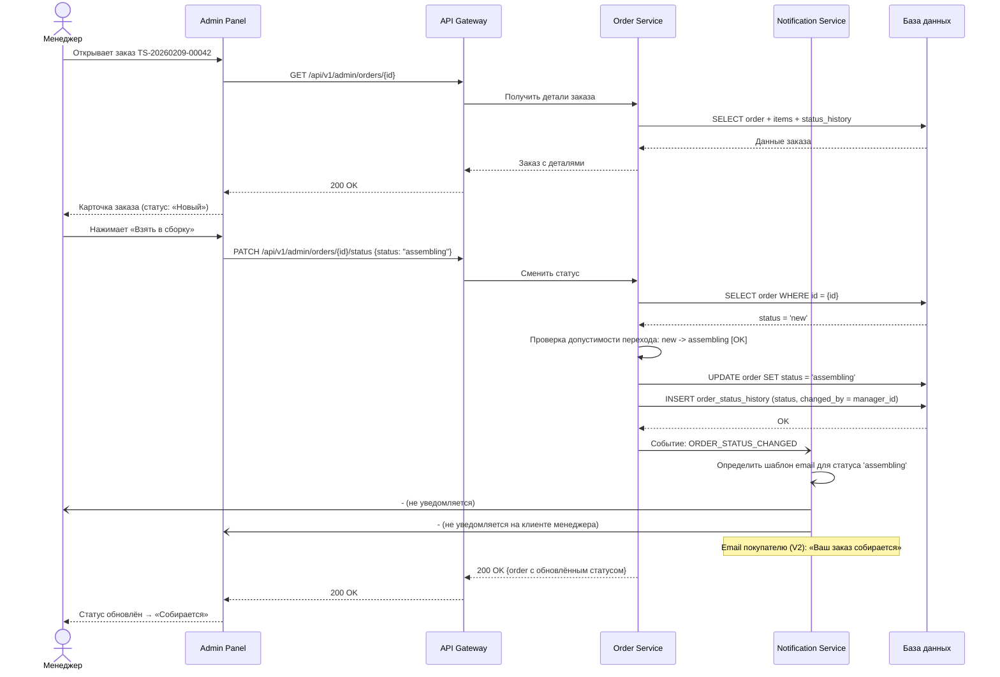

# Приложение B. Диаграммы последовательности (Sequence Diagrams)

> Диаграммы выполнены в нотации Mermaid.

---

## B.1 Оформление заказа - полный цикл (V1: самовывоз, оплата при получении)

---

## B.2 Оформление заказа с онлайн-оплатой (V2)

---

## B.3 Добавление товара в корзину

---

## B.4 Регистрация и авторизация

---

## B.5 Отмена заказа покупателем

---

## B.6 Поиск товаров с подсказками

---

## B.7 Смена статуса заказа менеджером

