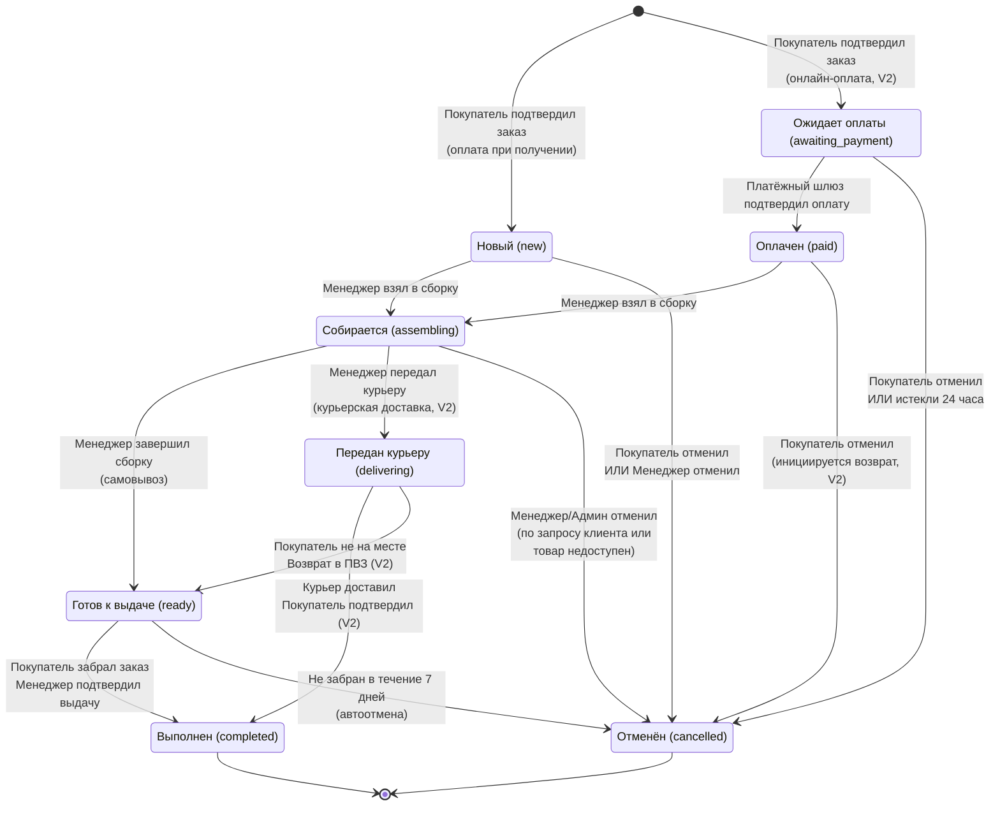
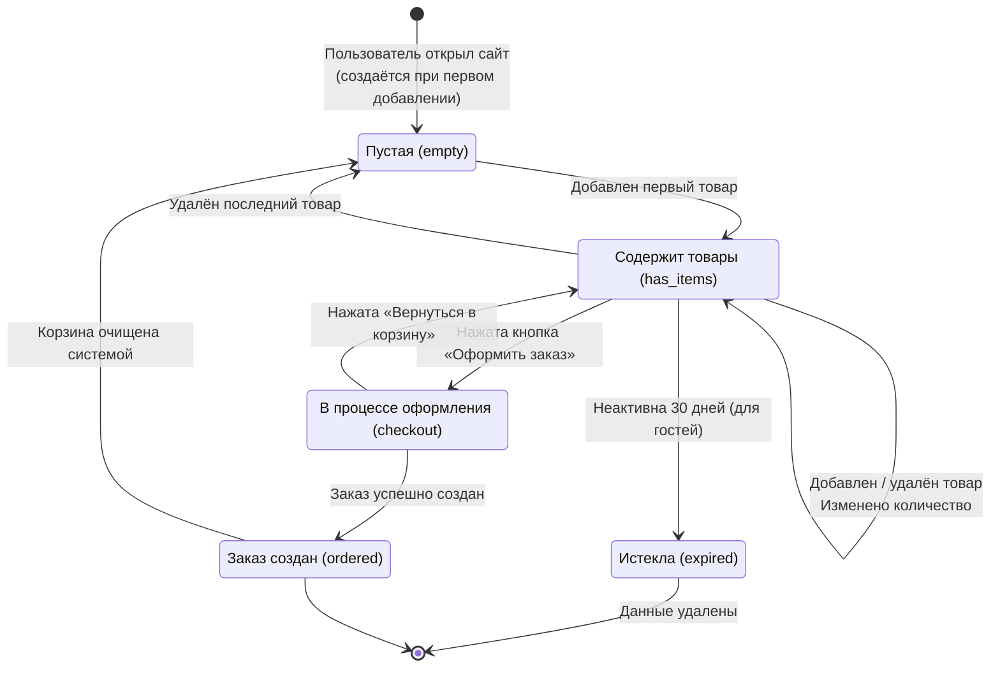
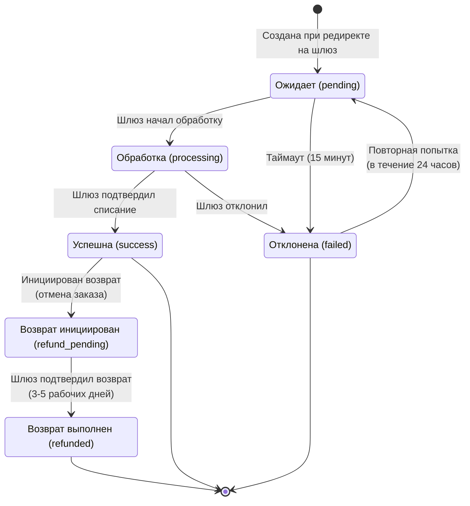
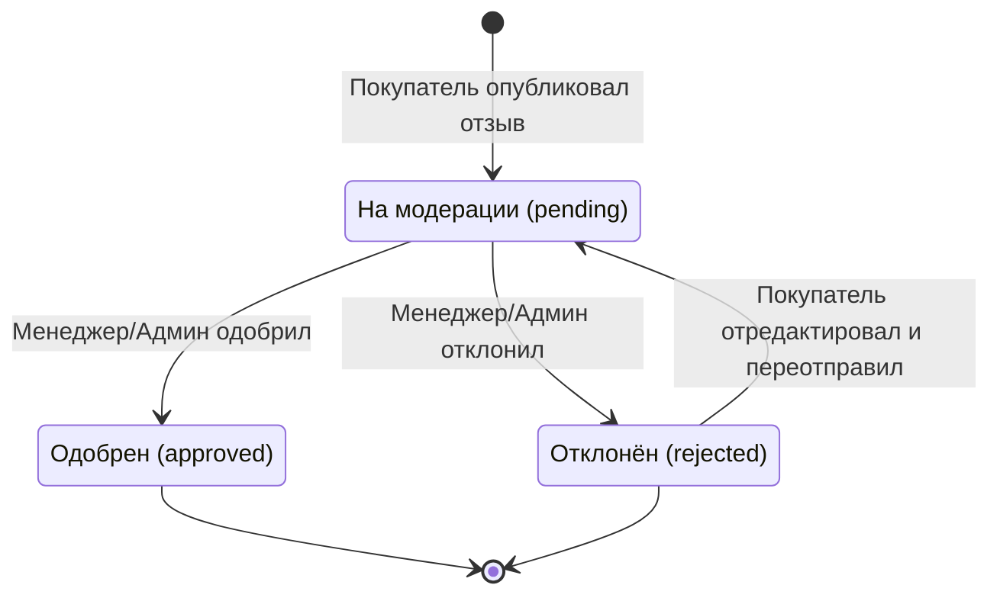
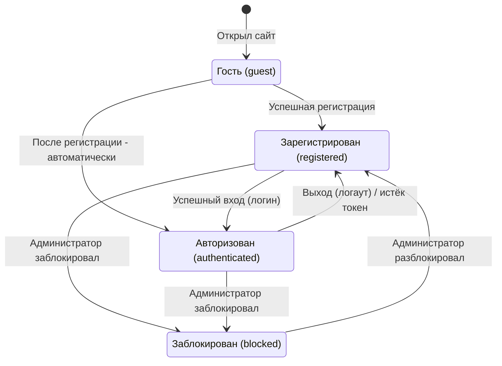
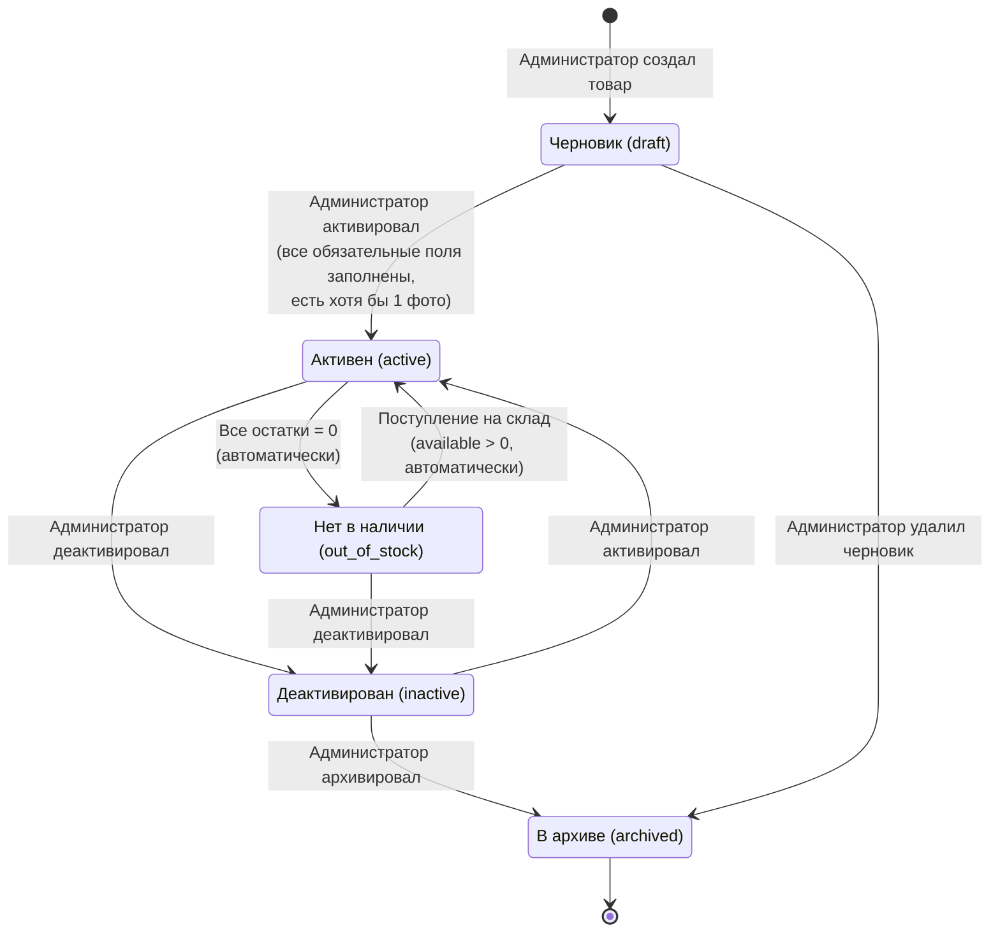
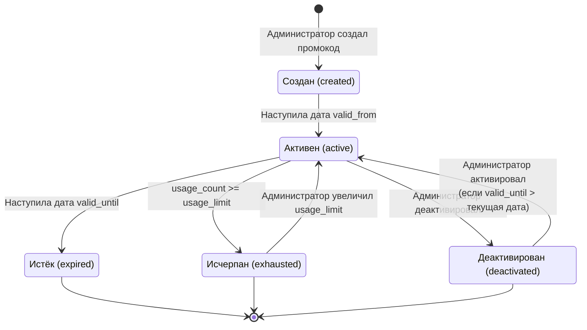

# Приложение C. Диаграммы состояний (State Diagrams)

> Диаграммы выполнены в нотации Mermaid.

---

## C.1 Жизненный цикл заказа (Order)

### Матрица допустимых переходов статусов

| Текущий статус | Допустимые переходы | Кто может выполнить |
|---------------|--------------------|--------------------|
| **new** (Новый) | → assembling, → cancelled | assembling: Менеджер. cancelled: Покупатель, Менеджер |
| **awaiting_payment** (Ожидает оплаты) | → paid, → cancelled | paid: Система (webhook от шлюза). cancelled: Покупатель, Система (24ч) |
| **paid** (Оплачен) | → assembling, → cancelled | assembling: Менеджер. cancelled: Покупатель (с возвратом), Менеджер |
| **assembling** (Собирается) | → ready, → delivering (V2), → cancelled | ready/delivering: Менеджер. cancelled: Менеджер, Администратор |
| **ready** (Готов к выдаче) | → completed, → cancelled | completed: Менеджер (подтверждение выдачи). cancelled: Система (7 дней) |
| **delivering** (Передан курьеру, V2) | → completed, → ready | completed: Менеджер/Курьер. ready: Менеджер (возврат) |
| **completed** (Выполнен) | - (финальный) | - |
| **cancelled** (Отменён) | - (финальный) | - |

### Автоматические переходы (по расписанию)

| Триггер | Переход | Условие |
|---------|---------|---------|
| Cron-задача, каждые 15 минут | awaiting_payment → cancelled | created_at + 24 часа < текущее время |
| Cron-задача, каждый день в 00:00 | ready → cancelled | ready_at + 7 дней < текущее время |

---

## C.2 Жизненный цикл корзины (Cart)

### Правила истечения корзины

| Тип пользователя | Срок жизни корзины | Действие по истечению |
|-------------------|-------------------|---------------------|
| Гость | 30 дней без активности | Корзина удаляется (cron-задача) |
| Авторизованный | Без ограничений | Не удаляется, но товары могут стать недоступны |

---

## C.3 Жизненный цикл платёжной транзакции (V2)

---

## C.4 Жизненный цикл отзыва (Review, V2)

### Правила модерации

| Правило | Описание |
|---------|----------|
| Автоодобрение | Если текст не содержит стоп-слов и оценка >= 3, отзыв может быть автоматически одобрен (настройка администратора) |
| Срок модерации | Отзыв должен быть рассмотрен в течение 24 часов |
| Причина отклонения | При отклонении менеджер обязан указать причину (спам / нецензурная лексика / не относится к товару / другое) |

---

## C.5 Жизненный цикл пользователя (User)

---

## C.6 Жизненный цикл товара в системе (Product)

### Правила отображения товара в зависимости от состояния

| Состояние | Виден в каталоге | Карточка доступна | Кнопка «В корзину» |
|-----------|-----------------|-------------------|-------------------|
| **draft** | Нет | Нет | - |
| **active** | Да | Да | Активна |
| **out_of_stock** | Да | Да | Заменена на «Нет в наличии» |
| **inactive** | Нет | Нет (404) | - |
| **archived** | Нет | Нет (404) | - |

---

## C.7 Жизненный цикл промокода (PromoCode, V2)

