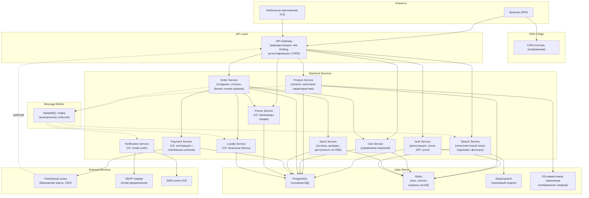
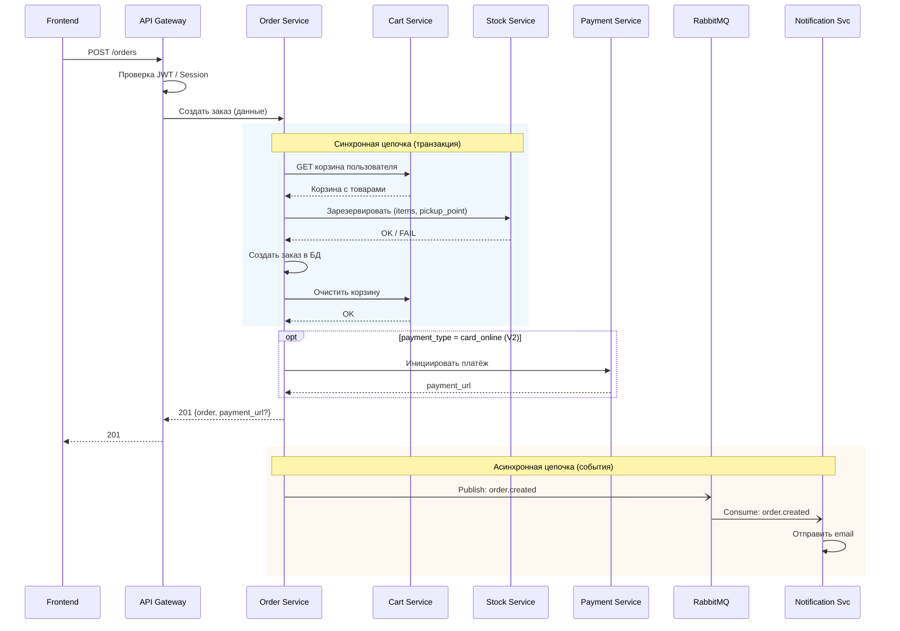
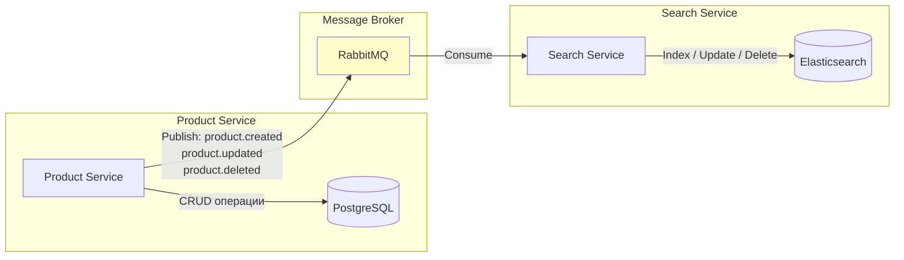
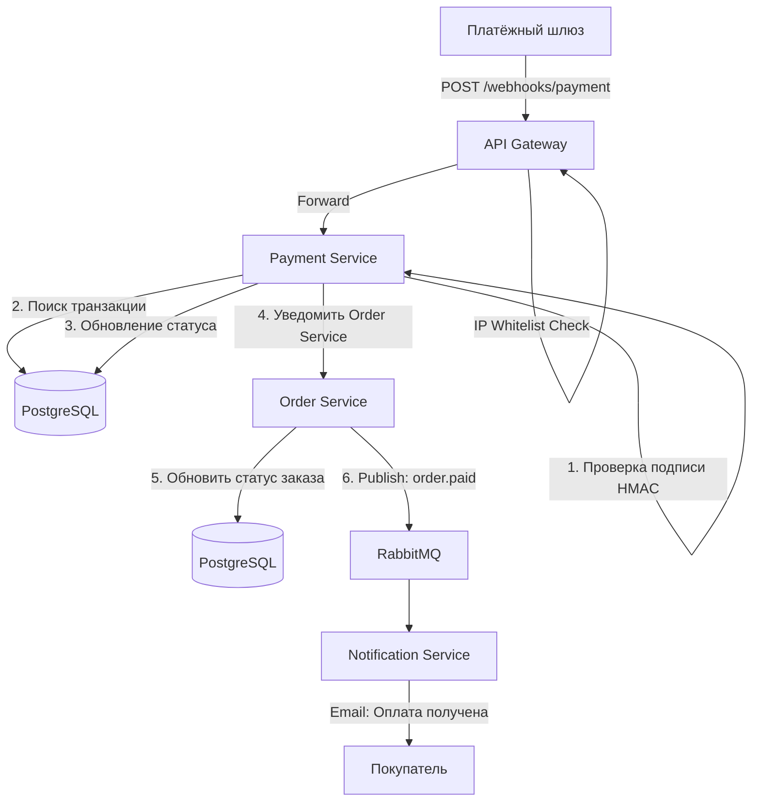

# Приложение E. Схема взаимодействия сервисов

> Документ описывает микросервисную архитектуру интернет-магазина «ТехноСфера», взаимодействие между компонентами и используемые технологии.

---

## E.1 Общая архитектура системы

---

## E.2 Описание сервисов

### E.2.1 API Gateway

| Параметр | Описание |
|----------|----------|
| **Назначение** | Единая точка входа для всех клиентских запросов |
| **Функции** | Маршрутизация запросов к целевым сервисам; JWT-аутентификация и проверка ролей; Rate limiting (100 req/min гость, 300 req/min авторизованный); CORS-политики; Логирование запросов; Трансформация ответов |
| **Технология** | Nginx + OpenResty или Kong |
| **Протокол** | HTTPS (вход), HTTP/gRPC (внутри) |

### E.2.2 Auth Service

| Параметр | Описание |
|----------|----------|
| **Назначение** | Управление аутентификацией и авторизацией |
| **Функции** | Регистрация, логин, логаут; Генерация и валидация JWT (access: 30 мин, refresh: 30 дней); Хеширование паролей (bcrypt, cost=12); Управление ролями (customer, manager, admin); Восстановление пароля; Блокировка после 5 неудачных попыток |
| **Хранилище** | PostgreSQL (пользователи), Redis (сессии, blacklist токенов) |
| **Зависимости** | Не зависит от других бизнес-сервисов |

### E.2.3 Product Service

| Параметр | Описание |
|----------|----------|
| **Назначение** | Управление каталогом, категориями, товарами |
| **Функции** | CRUD товаров и категорий; Получение карточки товара с характеристиками; Управление изображениями (загрузка в S3); Отдача списков с пагинацией и фильтрацией; Публикация событий при изменении товара (для переиндексации) |
| **Хранилище** | PostgreSQL (товары, категории), Redis (кеш каталога, TTL 5 мин), S3 (изображения) |
| **Публикует события** | `product.created`, `product.updated`, `product.deleted` → RabbitMQ (для Search Service) |

### E.2.4 Cart Service

| Параметр | Описание |
|----------|----------|
| **Назначение** | Управление корзинами пользователей и гостей |
| **Функции** | Добавление, удаление, изменение количества товаров; Привязка корзины гостя к пользователю при регистрации/входе; Объединение корзин при авторизации; Валидация наличия и цен при получении корзины; Очистка при создании заказа; Автоудаление просроченных корзин гостей (30 дней) |
| **Хранилище** | PostgreSQL (корзины авторизованных), Redis (корзины гостей, сессионные данные) |
| **Зависимости** | Product Service (данные о товарах), Stock Service (проверка остатков) |

### E.2.5 Order Service

| Параметр | Описание |
|----------|----------|
| **Назначение** | Ядро бизнес-логики заказов |
| **Функции** | Создание заказа (валидация, резервирование, фиксация цен); Управление статусами (с проверкой матрицы переходов); Отмена заказа (с возвратом резерва); Автоматическая отмена неоплаченных заказов (cron, каждые 15 мин); Автоматическая отмена невостребованных заказов (cron, ежедневно); Генерация уникальных номеров заказов |
| **Хранилище** | PostgreSQL |
| **Зависимости** | Stock Service (резервирование), Cart Service (получение и очистка корзины), Payment Service (инициация платежа, V2), Promo Service (валидация промокода, V2), Loyalty Service (списание/начисление баллов, V3) |
| **Публикует события** | `order.created`, `order.status_changed`, `order.cancelled`, `order.paid` → RabbitMQ |

### E.2.6 Stock Service

| Параметр | Описание |
|----------|----------|
| **Назначение** | Управление складскими остатками и резервами |
| **Функции** | Хранение остатков по связке (товар + ПВЗ); Резервирование при создании заказа (атомарная операция); Снятие резерва при отмене; Проверка доступности товаров по конкретному ПВЗ; Расчёт суммарного остатка по SKU |
| **Хранилище** | PostgreSQL (с pessimistic locking при резервировании), Redis (кеш доступности, TTL 1 мин) |
| **Критичность** | Высокая - все операции резервирования выполняются в транзакции с блокировкой строки (SELECT FOR UPDATE) |

### E.2.7 Search Service

| Параметр | Описание |
|----------|----------|
| **Назначение** | Полнотекстовый поиск и фасетная навигация по каталогу |
| **Функции** | Индексация товаров (по событиям из RabbitMQ); Полнотекстовый поиск с учётом морфологии русского языка; Подсказки при вводе (prefix match); Фасетная навигация (бренды, категории, ценовые диапазоны); Коррекция опечаток (fuzzy search) |
| **Хранилище** | Elasticsearch (поисковый индекс), Redis (кеш подсказок, TTL 5 мин) |
| **Подписан на события** | `product.created`, `product.updated`, `product.deleted` |

### E.2.8 Payment Service (V2)

| Параметр | Описание |
|----------|----------|
| **Назначение** | Интеграция с внешним платёжным шлюзом |
| **Функции** | Создание платёжной сессии (получение payment_url); Обработка webhook-ов от шлюза (подтверждение/отклонение); Инициация возвратов; Логирование всех транзакций; Проверка подписи webhook (HMAC SHA-256); Повторные попытки оплаты |
| **Хранилище** | PostgreSQL (транзакции) |
| **Внешние интеграции** | Платёжный шлюз (REST API + webhooks) |
| **Безопасность** | Whitelist IP для входящих webhooks; HMAC-верификация; Нет хранения данных карт (PCI DSS - на стороне шлюза) |

### E.2.9 Notification Service (V2)

| Параметр | Описание |
|----------|----------|
| **Назначение** | Отправка уведомлений пользователям |
| **Функции** | Email-уведомления (подтверждение заказа, смена статуса, оплата, отмена, возврат); Шаблонизация писем (Mustache/Handlebars); Очередь отправки с ретраями (до 3 попыток); Логирование статуса доставки |
| **Хранилище** | PostgreSQL (логи отправки) |
| **Подписан на события** | `order.created`, `order.status_changed`, `order.cancelled`, `order.paid` |
| **Внешние интеграции** | SMTP-сервер; (V3) SMS-шлюз |

### E.2.10 Promo Service (V2)

| Параметр | Описание |
|----------|----------|
| **Назначение** | Управление промокодами и расчёт скидок |
| **Функции** | CRUD промокодов; Валидация промокода (активность, даты, лимиты, мин. сумма); Расчёт суммы скидки; Инкремент счётчика использований |
| **Хранилище** | PostgreSQL |

### E.2.11 Loyalty Service (V3)

| Параметр | Описание |
|----------|----------|
| **Назначение** | Программа лояльности (бонусные баллы) |
| **Функции** | Начисление баллов при выполнении заказа (5% от суммы, округление вниз); Списание баллов при оплате (не более 30% от суммы); Отмена начисления при возврате; Просмотр баланса и истории |
| **Хранилище** | PostgreSQL |
| **Подписан на события** | `order.completed`, `order.cancelled` |

---

## E.3 Матрица взаимодействий сервисов

| Вызывающий | Вызываемый | Тип связи | Описание |
|-----------|-----------|-----------|----------|
| API Gateway | Auth Service | Sync (HTTP) | Проверка JWT, регистрация, логин |
| API Gateway | Product Service | Sync (HTTP) | Каталог, товары, категории |
| API Gateway | Cart Service | Sync (HTTP) | Операции с корзиной |
| API Gateway | Order Service | Sync (HTTP) | Создание заказа, просмотр, отмена |
| API Gateway | Search Service | Sync (HTTP) | Поиск, подсказки |
| API Gateway | Promo Service | Sync (HTTP) | Валидация промокода (V2) |
| API Gateway | Payment Service | Sync (HTTP) | Webhook от шлюза (V2) |
| Cart Service | Product Service | Sync (HTTP) | Получение данных о товарах |
| Cart Service | Stock Service | Sync (HTTP) | Проверка остатков |
| Order Service | Stock Service | Sync (HTTP) | Резервирование / снятие резерва |
| Order Service | Cart Service | Sync (HTTP) | Получение и очистка корзины |
| Order Service | Payment Service | Sync (HTTP) | Инициация платежа (V2) |
| Order Service | Promo Service | Sync (HTTP) | Валидация и применение промокода (V2) |
| Order Service | Loyalty Service | Sync (HTTP) | Списание баллов (V3) |
| Order Service | RabbitMQ | Async (publish) | События заказа |
| Product Service | RabbitMQ | Async (publish) | События изменения товаров |
| RabbitMQ | Notification Service | Async (consume) | Отправка уведомлений |
| RabbitMQ | Search Service | Async (consume) | Переиндексация товаров |
| RabbitMQ | Loyalty Service | Async (consume) | Начисление/отмена баллов |
| Payment Service | Платёжный шлюз | Sync (HTTPS) | Создание платежа, возвраты |
| Платёжный шлюз | Payment Service | Async (webhook) | Уведомление о статусе платежа |
| Notification Service | SMTP | Sync (SMTP) | Отправка email |

---

## E.4 Схема взаимодействия при создании заказа

---

## E.5 Схема синхронизации поискового индекса

**Гарантия согласованности:**
- При изменении товара Product Service публикует событие в RabbitMQ.
- Search Service подписан на очередь `product.events` и обновляет индекс Elasticsearch.
- В случае сбоя - сообщение остаётся в очереди (durable queue, manual ack).
- Переиндексация полного каталога - background job, запускается администратором вручную или по расписанию (1 раз в сутки).
- Максимальная задержка между изменением в БД и появлением в поиске: 5 секунд при штатной работе.

---

## E.6 Обработка платёжных webhooks (V2)

**Обработка дубликатов:** Payment Service использует `payment_id` от шлюза как идемпотентный ключ. Повторный webhook с тем же `payment_id` не приводит к повторному изменению статуса.

---

## E.7 Нефункциональные требования к архитектуре

### E.7.1 Масштабирование

| Компонент | Стратегия масштабирования |
|-----------|--------------------------|
| API Gateway | Горизонтальное (несколько инстансов за балансировщиком) |
| Backend Services | Горизонтальное (stateless, несколько инстансов каждого) |
| PostgreSQL | Вертикальное (V1). Read replicas (V2). Шардирование (V3, при необходимости) |
| Redis | Cluster mode (V2+) |
| Elasticsearch | 3 ноды (V1). Масштабирование шардов (V2+) |
| RabbitMQ | Cluster из 3 нод для отказоустойчивости |

### E.7.2 Отказоустойчивость

| Ситуация | Стратегия |
|----------|-----------|
| Недоступен Stock Service | Заказ не создаётся. Ответ 503 «Сервис временно недоступен. Повторите через 1 минуту» |
| Недоступен Payment Service (V2) | Заказ создаётся со статусом `new` и payment_type = `cash_on_delivery` (fallback). Покупатель уведомляется |
| Недоступен Notification Service | Заказ создаётся. Уведомления доставляются с задержкой (после восстановления - из очереди) |
| Недоступен Search Service | Поиск недоступен. Навигация по каталогу (по категориям) продолжает работать через Product Service |
| Недоступен RabbitMQ | Синхронные операции работают. Асинхронные (уведомления, индексация) - откладываются. Outbox pattern для гарантии доставки |

### E.7.3 Мониторинг

| Компонент | Метрики |
|-----------|---------|
| Все сервисы | Latency (p50, p95, p99), Error rate, RPS |
| Order Service | Количество заказов/час, конверсия корзина→заказ, среднее время оформления |
| Stock Service | Количество конфликтов резерва, среднее время блокировки |
| Payment Service (V2) | Успешность платежей (%), среднее время ответа шлюза |
| Search Service | Среднее время поиска, cache hit ratio |
| Notification Service | Количество отправленных/неотправленных, среднее время доставки |

**Инструменты:** Prometheus (сбор метрик) + Grafana (визуализация) + ELK Stack (логирование) + Jaeger (distributed tracing).

### E.7.4 Безопасность

| Аспект | Реализация |
|--------|------------|
| Передача данных | HTTPS/TLS 1.3 для внешних соединений. mTLS между сервисами (V2+) |
| Аутентификация | JWT (RS256). Access token: 30 мин. Refresh token: 30 дней |
| Авторизация | RBAC (Role-Based Access Control) на уровне API Gateway |
| Хеширование паролей | bcrypt, cost factor = 12 |
| Защита от перебора | Rate limiting + блокировка после 5 неудачных попыток (15 мин) |
| Платёжные данные | Не хранятся в системе. PCI DSS - на стороне платёжного шлюза |
| SQL Injection | Parameterized queries через ORM |
| XSS | Content Security Policy, экранирование вывода |
| CSRF | SameSite cookies + CSRF-token для форм |
| Webhook | IP whitelist + HMAC SHA-256 подпись |

---

## E.8 Стек технологий (рекомендация)

| Компонент | Технология | Обоснование |
|-----------|-----------|-------------|
| Frontend | React + TypeScript + Next.js | SSR для SEO, типизация |
| API Gateway | Nginx / Kong | Производительность, экосистема плагинов |
| Backend Services | Go / Node.js (TypeScript) | Go: Order, Stock, Auth (производительность). Node.js: остальные (скорость разработки) |
| БД | PostgreSQL 16 | Транзакции, надёжность, JSON-поддержка |
| Кеш | Redis 7 | Корзины гостей, кеш каталога, сессии |
| Поиск | Elasticsearch 8 | Полнотекстовый поиск, morphology-ru |
| Брокер сообщений | RabbitMQ 3.13 | Гарантия доставки, routing, dead letter queues |
| Хранилище файлов | MinIO / AWS S3 | Изображения товаров |
| Контейнеризация | Docker + Kubernetes | Оркестрация, масштабирование, CI/CD |
| CI/CD | GitLab CI / GitHub Actions | Автоматические тесты и деплой |
| Мониторинг | Prometheus + Grafana | Метрики и алерты |
| Логирование | ELK Stack (Elasticsearch + Logstash + Kibana) | Централизованные логи |
| Трейсинг | Jaeger / OpenTelemetry | Отслеживание запросов между сервисами |
