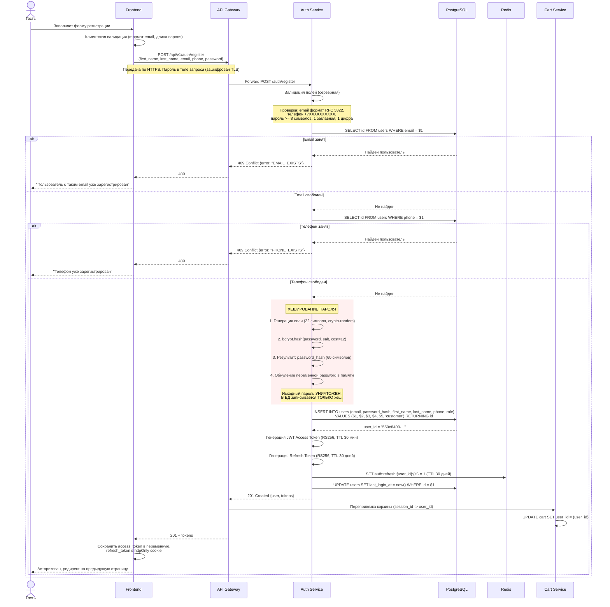
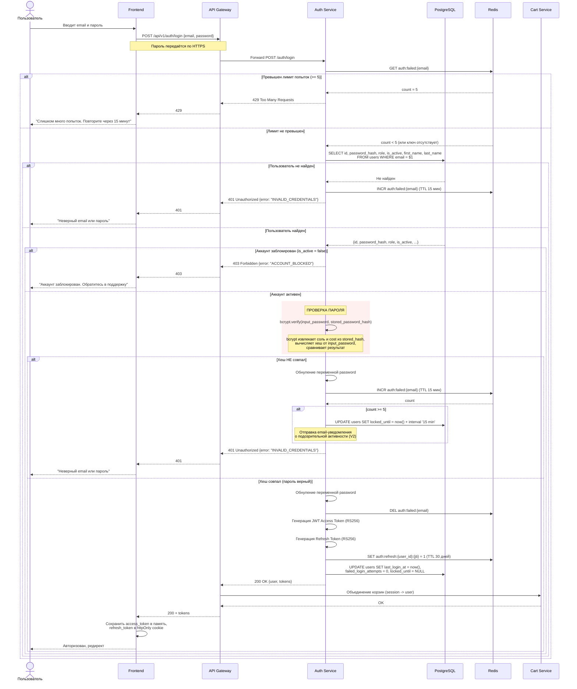
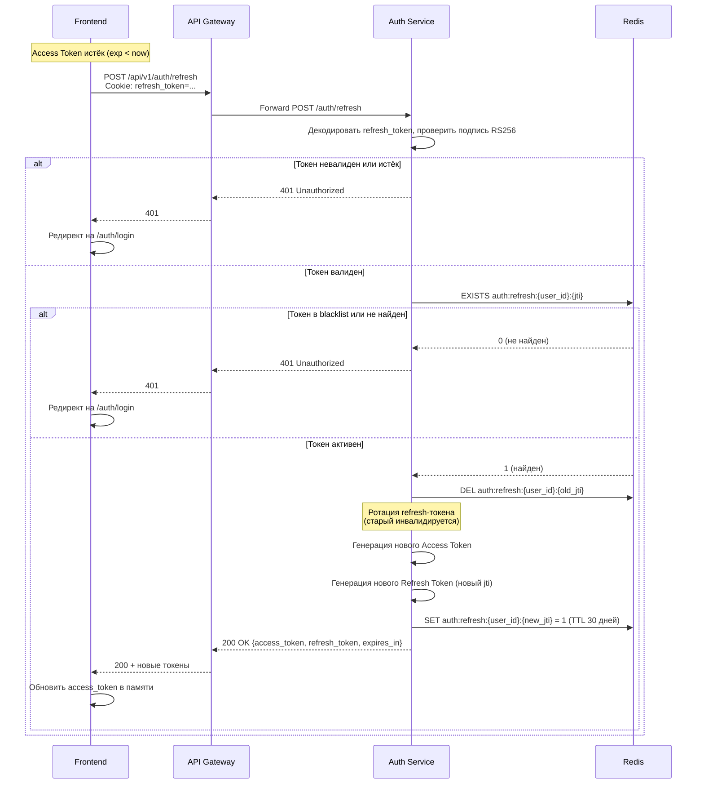
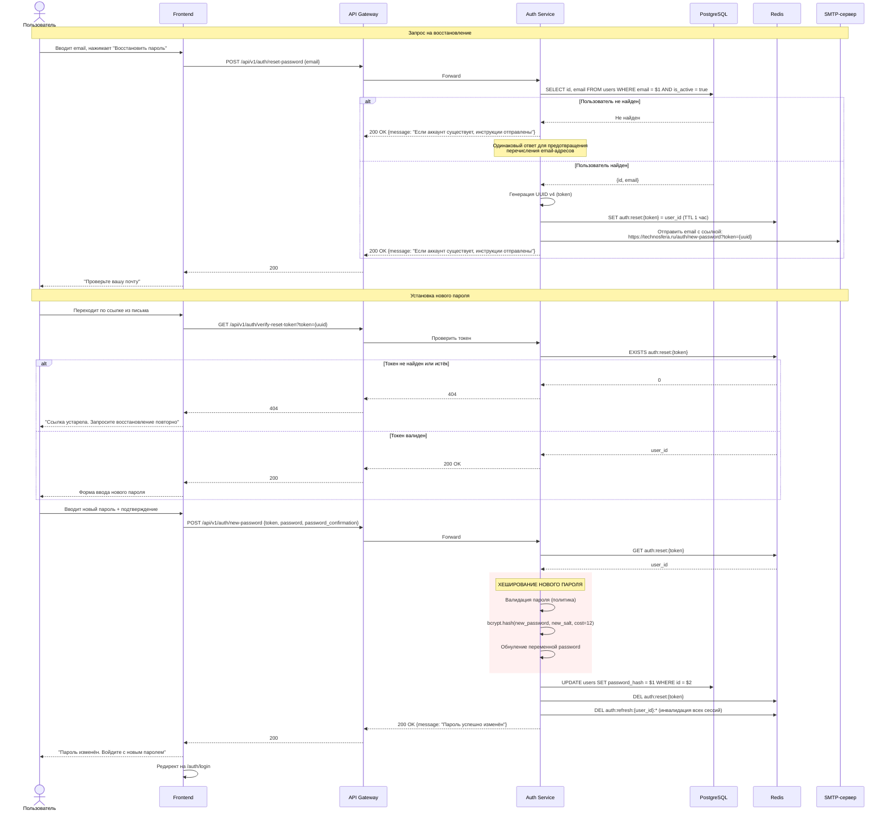
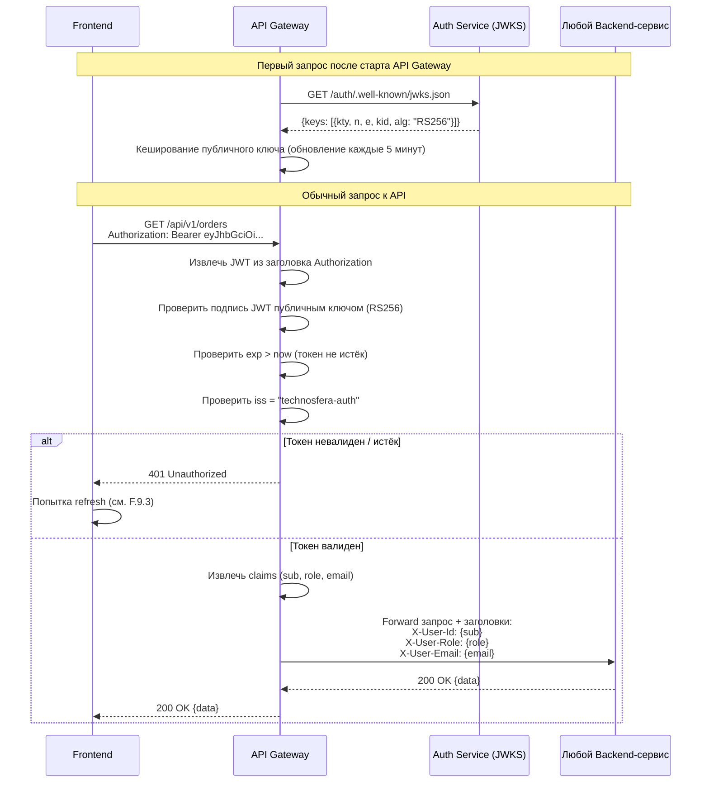

# Приложение F. Сервис авторизации (Auth Service)

**Версия:** 1.0
**Дата:** 10.02.2026

---

## F.1 Назначение

Auth Service -- выделенный микросервис, отвечающий за:
- регистрацию новых пользователей;
- аутентификацию (проверку учётных данных);
- управление сессиями (JWT-токены);
- управление ролями и правами доступа;
- восстановление пароля;
- защиту от перебора.

Auth Service является единственной точкой системы, которая взаимодействует с таблицей учётных данных пользователей. Другие сервисы получают информацию о пользователе исключительно из валидированного JWT-токена.

---

## F.2 Принцип хранения паролей

**В базе данных хранится ТОЛЬКО хеш пароля. Исходный пароль в открытом виде не сохраняется, не логируется и не передаётся между сервисами.**

### F.2.1 Алгоритм хеширования

| Параметр | Значение |
|----------|----------|
| Алгоритм | bcrypt |
| Cost factor (раунды) | 12 |
| Длина результирующего хеша | 60 символов |
| Формат хеша | `$2b$12$<22-символьная_соль><31-символьный_хеш>` |

### F.2.2 Процесс создания хеша при регистрации

1. Пользователь передаёт пароль в открытом виде по HTTPS.
2. Auth Service получает пароль в оперативной памяти.
3. Auth Service проверяет пароль на соответствие политике (см. F.2.3).
4. bcrypt генерирует криптографически стойкую случайную соль (22 символа).
5. bcrypt вычисляет хеш: `hash = bcrypt(password, salt, cost=12)`.
6. В таблицу `users` записывается значение поля `password_hash` (60 символов).
7. Исходный пароль удаляется из оперативной памяти (обнуление переменной).
8. В логах Auth Service пароль не фиксируется ни при каких обстоятельствах.

### F.2.3 Политика паролей

| Правило | Значение |
|---------|----------|
| Минимальная длина | 8 символов |
| Максимальная длина | 128 символов |
| Обязательные символы | Минимум 1 заглавная буква (A-Z, А-Я) |
| Обязательные символы | Минимум 1 цифра (0-9) |
| Запрещённые значения | Email пользователя, номер телефона, слова из списка частых паролей (top-10000) |
| Хранение предыдущих паролей | Последние 3 хеша (V2, для проверки при смене пароля) |

### F.2.4 Процесс проверки пароля при авторизации

1. Пользователь передаёт email + пароль по HTTPS.
2. Auth Service находит запись пользователя по email.
3. Из поля `password_hash` извлекается сохранённый хеш (содержит соль и параметры).
4. bcrypt выполняет: `result = bcrypt.verify(input_password, stored_hash)`.
5. Если `result = true` -- пароль верный, генерируются JWT-токены.
6. Если `result = false` -- ответ 401, инкремент счётчика неудачных попыток.
7. Исходный пароль удаляется из оперативной памяти.

**Важно:** bcrypt автоматически использует соль, встроенную в хеш, поэтому отдельное хранение соли не требуется.

---

## F.3 JWT-токены

### F.3.1 Типы токенов

| Параметр | Access Token | Refresh Token |
|----------|-------------|---------------|
| Назначение | Аутентификация запросов к API | Получение нового Access Token |
| Алгоритм подписи | RS256 (RSA + SHA-256) | RS256 |
| Время жизни | 30 минут | 30 дней |
| Где хранится (клиент) | В памяти JavaScript (переменная) | httpOnly secure cookie (SameSite=Strict) |
| Передача | Заголовок `Authorization: Bearer <token>` | Cookie (автоматически) |
| Отзываемость | Нет (истекает сам) | Да (blacklist в Redis) |

### F.3.2 Payload Access Token (JWT Claims)

```json
{
  "sub": "550e8400-e29b-41d4-a716-446655440000",
  "email": "ivan@example.com",
  "role": "customer",
  "first_name": "Иван",
  "last_name": "Петров",
  "iat": 1739097000,
  "exp": 1739098800,
  "iss": "technosfera-auth",
  "jti": "unique-token-id-uuid"
}
```

| Claim | Описание |
|-------|----------|
| sub | UUID пользователя |
| email | Email пользователя |
| role | Роль: customer / manager / admin |
| first_name | Имя (для отображения на фронтенде без запроса к серверу) |
| last_name | Фамилия |
| iat | Время выдачи (Unix timestamp) |
| exp | Время истечения (iat + 1800 секунд) |
| iss | Издатель токена |
| jti | Уникальный ID токена (для предотвращения replay-атак) |

### F.3.3 Ротация ключей

| Параметр | Значение |
|----------|----------|
| Тип ключей | RSA 2048-bit (пара: private + public) |
| Ротация | Каждые 90 дней |
| Публичный ключ | Доступен по эндпоинту `GET /auth/.well-known/jwks.json` для валидации другими сервисами |
| Поддержка старых ключей | При ротации -- предыдущий ключ остаётся валидным ещё 30 минут (время жизни последнего access token) |

---

## F.4 Защита от перебора (Brute Force Protection)

| Правило | Значение |
|---------|----------|
| Лимит неудачных попыток | 5 подряд для одного email |
| Блокировка | На 15 минут |
| Уведомление | Email пользователю: "Обнаружены подозрительные попытки входа в ваш аккаунт" |
| Rate limiting (по IP) | 10 запросов на /auth/login в минуту |
| Rate limiting (регистрация) | 5 запросов на /auth/register в минуту с одного IP |
| Хранение счётчиков | Redis (ключ: `auth:failed:{email}`, TTL: 15 минут) |
| Сброс счётчика | После успешного входа |

---

## F.5 Процесс восстановления пароля

1. Пользователь запрашивает восстановление, указывая email (`POST /auth/reset-password`).
2. Система ВСЕГДА отвечает одинаково: "Если аккаунт существует, инструкции отправлены" (защита от перечисления email).
3. Если email найден -- генерируется одноразовый токен (UUID v4), сохраняется в Redis (TTL: 1 час).
4. На email отправляется ссылка: `https://technosfera.ru/auth/new-password?token={uuid}`.
5. Пользователь переходит по ссылке, вводит новый пароль.
6. `POST /auth/new-password` с token + new_password.
7. Auth Service проверяет: токен существует в Redis и не истёк.
8. Новый пароль хешируется bcrypt (cost=12), записывается в `password_hash`.
9. Токен удаляется из Redis (одноразовый).
10. Все активные refresh-токены пользователя инвалидируются (добавляются в blacklist).

---

## F.6 Таблица users (схема хранения)

```sql
CREATE TABLE users (
    id              UUID PRIMARY KEY DEFAULT gen_random_uuid(),
    email           VARCHAR(255) NOT NULL UNIQUE,
    password_hash   VARCHAR(255) NOT NULL,  -- ТОЛЬКО bcrypt-хеш, НИКОГДА открытый пароль
    first_name      VARCHAR(100) NOT NULL,
    last_name       VARCHAR(100) NOT NULL,
    phone           VARCHAR(20)  NOT NULL UNIQUE,
    role            VARCHAR(20)  NOT NULL DEFAULT 'customer'
                    CHECK (role IN ('customer', 'manager', 'admin')),
    is_active       BOOLEAN NOT NULL DEFAULT true,
    failed_login_attempts INTEGER NOT NULL DEFAULT 0,
    locked_until    TIMESTAMP WITH TIME ZONE,
    last_login_at   TIMESTAMP WITH TIME ZONE,
    created_at      TIMESTAMP WITH TIME ZONE NOT NULL DEFAULT now(),
    updated_at      TIMESTAMP WITH TIME ZONE NOT NULL DEFAULT now()
);

CREATE INDEX idx_users_email ON users (email);
CREATE INDEX idx_users_phone ON users (phone);
CREATE INDEX idx_users_role  ON users (role);
```

**Ключевые поля безопасности:**

| Поле | Описание |
|------|----------|
| password_hash | Хеш bcrypt (60 символов). Пример: `$2b$12$LJ3m4ys3Lg.HnEIS9hNcdu7B9IqZCWxlR1NBJR.kFYsGjQyKGdIKy` |
| failed_login_attempts | Счётчик неудачных попыток входа. Сбрасывается при успешном входе |
| locked_until | Время, до которого аккаунт заблокирован для входа. NULL -- не заблокирован |
| last_login_at | Время последнего успешного входа |

---

## F.7 Структура Redis-ключей Auth Service

| Ключ | Тип | TTL | Описание |
|------|-----|-----|----------|
| `auth:refresh:{user_id}:{jti}` | String | 30 дней | Активный refresh-токен |
| `auth:blacklist:{jti}` | String | 30 минут | Инвалидированный access-токен (при logout) |
| `auth:failed:{email}` | Integer | 15 минут | Счётчик неудачных попыток входа |
| `auth:reset:{token}` | String (user_id) | 1 час | Токен восстановления пароля |
| `auth:rate:{ip}:{endpoint}` | Integer | 1 минута | Счётчик rate limiting |

---

## F.8 Взаимодействие Auth Service с другими сервисами

```mermaid
graph TB
    subgraph "Клиент"
        FE["Frontend (SPA)"]
    end

    subgraph "API Layer"
        GW["API Gateway"]
    end

    subgraph "Auth Service"
        AuthAPI["Auth API<br/>(register, login, refresh,<br/>logout, reset-password)"]
        AuthLogic["Auth Business Logic<br/>(bcrypt, JWT, rate limiting)"]
    end

    subgraph "Data Stores"
        PG["PostgreSQL<br/>(users table)"]
        Redis["Redis<br/>(sessions, blacklist,<br/>rate counters)"]
    end

    subgraph "Другие сервисы"
        CartSvc["Cart Service"]
        OrderSvc["Order Service"]
        AdminAPI["Admin API"]
    end

    subgraph "Внешние"
        SMTP["SMTP<br/>(email восстановления)"]
    end

    FE -->|HTTPS| GW
    GW -->|/auth/*| AuthAPI
    AuthAPI --> AuthLogic
    AuthLogic -->|password_hash, users| PG
    AuthLogic -->|sessions, blacklist| Redis

    GW -->|Валидация JWT<br/>(public key)| GW
    GW -->|Только валидированные запросы| CartSvc
    GW -->|Только валидированные запросы| OrderSvc
    GW -->|role=admin/manager| AdminAPI

    AuthLogic -->|Письмо восстановления| SMTP
```

### Принцип взаимодействия

1. **Регистрация / Логин / Refresh / Logout** -- запросы идут напрямую к Auth Service через API Gateway.
2. **Валидация токенов** -- API Gateway самостоятельно проверяет подпись JWT с помощью публичного ключа (без обращения к Auth Service). Это обеспечивает высокую производительность.
3. **Другие сервисы** никогда не обращаются к Auth Service напрямую. Они получают информацию о пользователе из claims JWT-токена (sub, role, email), переданных API Gateway в заголовках.
4. **При компрометации токена** -- администратор может инвалидировать все refresh-токены пользователя через Auth Service, и через 30 минут (срок жизни access token) доступ полностью прекратится.

---

## F.9 Диаграммы последовательности

### F.9.1 Регистрация пользователя (полный цикл с хешированием)



### F.9.2 Авторизация (логин) с проверкой bcrypt-хеша



### F.9.3 Обновление Access Token (Refresh)



### F.9.4 Восстановление пароля



### F.9.5 Валидация JWT при запросе к защищённому эндпоинту



---

## F.10 Аудит безопасности

### F.10.1 Логируемые события

| Событие | Уровень | Что записывается |
|---------|---------|-----------------|
| Успешная регистрация | INFO | user_id, email, IP, User-Agent |
| Успешный вход | INFO | user_id, email, IP, User-Agent |
| Неудачный вход | WARN | email (без пароля!), IP, User-Agent, attempt_count |
| Блокировка аккаунта | WARN | email, IP, причина (brute force) |
| Восстановление пароля (запрос) | INFO | email, IP |
| Восстановление пароля (смена) | INFO | user_id, IP |
| Смена роли | WARN | user_id, old_role, new_role, admin_id |
| Logout | INFO | user_id |

**Запрещено логировать:** пароли (в любом виде), хеши паролей, полные JWT-токены, refresh-токены.
